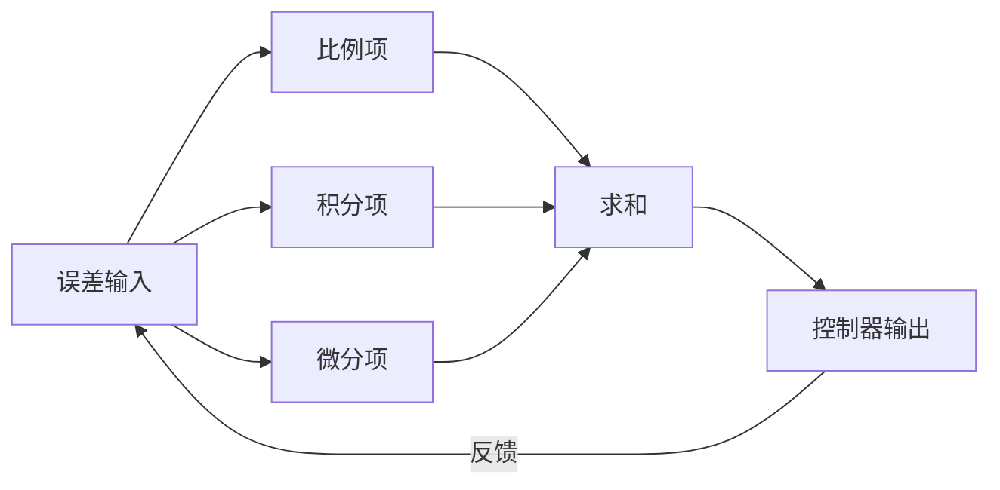
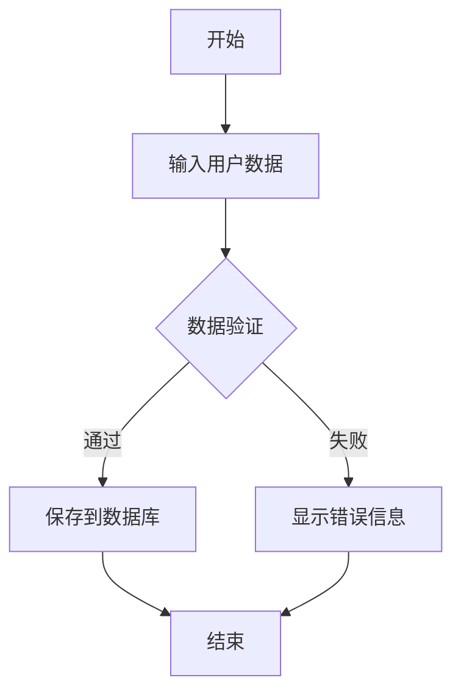

2025/03/29 00:10
# 名称
    分支
        dirver_raspberry_XXXXX_vX.X.X

    文件
        ./modules/app_XXX/app_XXX.c
        ./dirverModules/dirverModules/XXX.c

# 定义

# 流程

# 执行顺序

# 内部机制

# Makefile
# # XXXX ---------------------
XXXX-y := $(MODULES_DIR)/XXXX/XXXX.o
obj-m := XXXX.o

# 执行命令

insmod
rmmod

chmod +x main

ps -ef | grep main
kill -9 PID

ls /proc/device-tree/
ls /sys/devices/platform/
dmesg | tail
cat /proc/devices  
cd /sys/class 

sources/linux-rpi-6.6.y/arch/arm/boot/dts/broadcom/bcm2710-rpi-3-b-plus.dts
make ARCH=arm64 CROSS_COMPILE=aarch64-linux-gnu- dtbs -j$(nproc) 

dtc -I fs /sys/firmware/devicetree/base | less
# 扩展

# PID 控制算法
PID 是比例 Proportion 的缩写，I 是积分 Integral 的缩写，D 是微分 Derivative 的缩写。

PID  是一种闭环控制算法，它动态改变事假到被控制对象的输出值（out）， 使得 被控对象某一物理量的实际值（actual）能够快速 准确 稳定 的 跟踪到指定的目标值（target）。

PID是一种基于误差 （error）调控算法，其规定：误差 = 目标值 - 实际值， PID 的任务 是 使误差始终为 0

PID 对被控对象模型要求低， 无需建模。及时被控对象内部运作规律不明确， PID 也能进行调控

闭环控制： 有反馈

定义误差： error(t) = target(t) - actual(t)

定义 PID 控制器输出： out(t) = Kp * error(t) + Ki * integral(error(t)) + Kd * derivative(error(t))
    Kp  是 比例系数， Ki 是 积分系数， Kd 是 微分系数
    integral 是 积分： integral(error(t)) = integral(error(t), t0, t)； 
    derivative 是 微分

# 

$$
\text{out}(t) = K_p \cdot error(t) + K_i \int_{0}^{t} error(\tau) d\tau + K_d \frac{d}{dt}error(t)
$$

其中：
- $\text{out}(t)$: 控制器输出
- $e(t)$: 误差（设定值 - 实际值）
- $K_p$: 比例增益系数
- $K_i$: 积分增益系数
- $K_d$: 微分增益系数

定义 PID 控制器： PID = (Kp, Ki, Kd)

定义 PID 控制器输出： out(t) = PID * error(t)

# ================

# 比例项 P

比例项的输出值取决于当前时刻的误差， 与历史时刻无关，Kp 越大，输出值越大。

$$
\text{out}(t) = K_p \cdot error(t)
$$

# 积分项 I

积分项的输出值取决于历史时刻的误差， 与当前时刻的误差无关，Ki 越大，输出值越大。

$$
\text{out}(t) = K_i \int_{0}^{t} error(\tau) d\tau
$$

# 微分项 D

微分项的输出值取决于当前时刻的误差变化率， 与当前时刻的误差无关，Kd 越大，输出值越大。

$$
\text{out}(t) = K_d \frac{d}{dt}error(t)
$$

# 离散形式 

out(t) = Kp * error(t) + Ki * integral(error(t)) + Kd * derivative(error(t))

$$
\text{out}(t) = K_p \cdot error(t) + K_i \int_{0}^{t} error(\tau) d\tau + K_d \frac{d}{dt}error(t)
$$
的 离散是

$$
\text{out}(k) = K_p \cdot error(k) + K_i \cdot T_s \sum_{j=0}^{k} error(j) + K_d \cdot \frac{error(k) - error(k-1)}{T_s}
$$

其中：
- \( e(k) \)：当前时间步 \( k \) 的误差。
- \( T_s \)：采样时间间隔。
- \( \sum_{i=0}^{k} e(i) \)：从初始时间到当前时间步的误差累积（离散积分近似）。
- \( \frac{e(k) - e(k-1)}{T_s} \)：当前误差与前一误差的差值除以采样时间（离散微分近似）。
- \( K_p, K_i, K_d \)：分别为比例、积分和微分增益。

### 说明
1. **积分项**：连续形式的积分 \( \int_{0}^{t} error(\tau) d\tau \) 在离散形式中用累加 \( T_s \sum_{i=0}^{k} e(i) \) 近似，表示误差的累积。
2. **微分项**：连续形式的微分 \( \frac{d}{dt}error(t) \) 在离散形式中用后向差分 \( \frac{e(k) - e(k-1)}{T_s} \) 近似。
3. **采样时间 \( T_s \)**：需要根据具体应用选择合适的采样频率，确保离散化近似的精度。

### 实际实现中的注意事项
- **积分项累加**：为了避免积分饱和（integral windup），通常会对积分项设置上限或使用抗饱和技术。
- **微分项噪声**：微分项对噪声敏感，因此常在实际应用中加入低通滤波器或限制微分项的增益。
- **增益调整**：\( K_p, K_i, K_d \) 的值在离散形式中可能需要根据 \( T_s \) 进行调整，以确保与连续系统的性能一致。

将 Ts 设为 1，则
$$
\text{out}(k) = K_p \cdot error(k) + K_i \cdot \sum_{j=0}^{k} error(j) + K_d \cdot (error(k) - error(k-1))
$$

# 位置式 PID 与增量式 PID 公式

1 位置式 PID 由连续行驶 PID 直接离散得到，每次计算得到的全是 全量 的输出值，可以直接接给被控对象
2 增量式 PID 由位置 PID 推到得到，每次计算得到的书输出值的 增量，如果直接给被控对象，则需要被控对象内部有几分功能
3 增量式 PID 也可在控制器内进行积分， 然后输出积分后的 接口，此时增量式PID 与位置式 PID 整体功能没有区别
4 位置式PID 和增量式 PID 计算式产生的中间变量不同，如果对这些变量加以调节，可以实现不同特性

位置式 PID
    第 K 次调控 out k 的输出值
$$
\text{out}(k) = K_p \cdot error(k) + K_i \cdot \sum_{j=0}^{k} error(j) + K_d \cdot (error(k) - error(k-1))
$$

当 k = K - 1
$$
\text{out}(k - 1) = K_p \cdot error(k - 1) + K_i \cdot \sum_{j=0}^{k-1} error(j) + K_d \cdot (error(k - 1) - error(k - 2))
$$

两个 相减 得到增量式PID

增量式 PID

$$
\Delta \text{out}(k) = K_p \cdot (error(k) - error(k-1)) + K_i \cdot error(k) + K_d \cdot (error(k) - 2 \cdot error(k-1) + error(k-2))
$$

其中：
- \( \Delta \text{out}(k) \)：第 k 次调控的增量。
- \( e(k) \)：第 k 次调控的误差。
- \( K_p \)：比例增益。
- \( K_i \)：积分增益。
- \( K_d \)：微分增益。

# =======================

# 常用数学符号示例 =============

分数	$\frac{a}{b}$

上下标	$x^{2}_n$

平方根	$\sqrt[n]{x}$

求和	$\sum_{i=1}^{n} i$

积分	$\int_{a}^{b} f(x) dx$

矩阵	$\begin{bmatrix} a & b \\ c & d \end{bmatrix}$

向量	$\begin{bmatrix} a \\ b \end{bmatrix}$

行列式	$\begin{vmatrix} a & b \\ c & d \end{vmatrix}$

偏导数	$\frac{\partial f}{\partial x}$

梯度	$\nabla f$

极限	$\lim_{x \to a} f(x)$

导数	$\frac{dy}{dx}$

# 图标
🚀 火箭图标: `:rocket:`
⭐ 星标图标: `:star:`
🐛 Bug 图标: `:bug:`
📝 文档图标: `:memo:`
🔧 工具图标: `:wrench:`
⚠️ 警告图标: `:warning:`
💡 灯泡图标: `:bulb:`

# 图表

# 表格
| 姓名 | 年龄 | 性别 |
| ---- | ---- | ---- |
| 张三 | 25   | 男   |
| 李四 | 30   | 女   |
| 王五 | 28   | 男   |

