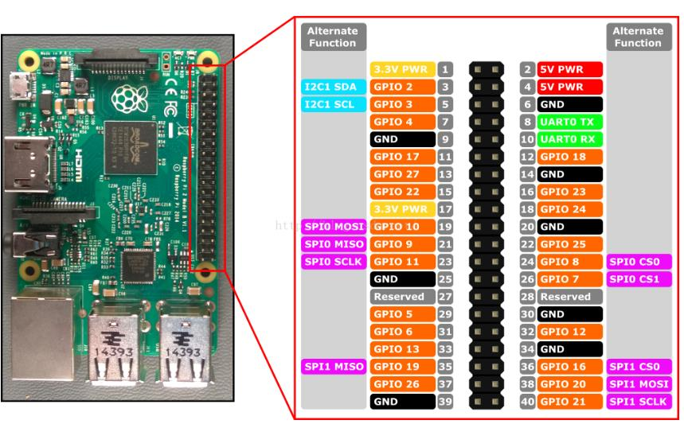

2025/10/18 00:10
# 名称
    分支
        dirver_raspberry_pwm_v0.6.1

    文件
        ./modules/app_pwm/app_pwm.c
        ./dirverModules/my_pwm/my_pwm.c
        
# 定义

# 流程

1 已经在 编辑了 
TEMP/usb/gadget/config.txt
 文件 最后一行 添加

dtoverlay=dwc2,dr_mode=peripheral

2 ls /sys/class/pwm/pwmchip0/

root@raspberrypi:/home/kingnan/TEMP# cd /sys/class/pwm/
root@raspberrypi:/sys/class/pwm# ls
pwmchip0
root@raspberrypi:/sys/class/pwm# cd pwmchip0
root@raspberrypi:/sys/class/pwm/pwmchip0# ls
device  export  npwm  power  subsystem  uevent  unexport
root@raspberrypi:/sys/class/pwm/pwmchip0# ls
device  export  npwm  power  subsystem  uevent  unexport
root@raspberrypi:/sys/class/pwm/pwmchip0# ls
device  export  npwm  power  subsystem  uevent  unexport
root@raspberrypi:/sys/class/pwm/pwmchip0# echo 0 > export
root@raspberrypi:/sys/class/pwm/pwmchip0# ls
device  export  npwm  power  pwm0  subsystem  uevent  unexport
root@raspberrypi:/sys/class/pwm/pwmchip0# cd pwm0
root@raspberrypi:/sys/class/pwm/pwmchip0/pwm0# ls
capture  duty_cycle  enable  period  polarity  power  uevent
root@raspberrypi:/sys/class/pwm/pwmchip0/pwm0# echo 1000000 > period
root@raspberrypi:/sys/class/pwm/pwmchip0/pwm0# echo 500000 > duty_cycle
root@raspberrypi:/sys/class/pwm/pwmchip0/pwm0# echo 1 > enable
root@raspberrypi:/sys/class/pwm/pwmchip0/pwm0# echo 300000 > duty_cycle
root@raspberrypi:/sys/class/pwm/pwmchip0/pwm0# echo 1 > enable
root@raspberrypi:/sys/class/pwm/pwmchip0/pwm0# echo 100000 > duty_cycle
root@raspberrypi:/sys/class/pwm/pwmchip0/pwm0# echo 800000 > duty_cycle
root@raspberrypi:/sys/class/pwm/pwmchip0/pwm0# echo 900000 > duty_cycle
root@raspberrypi:/sys/class/pwm/pwmchip0/pwm0# echo 200000 > duty_cycle
root@raspberrypi:/sys/class/pwm/pwmchip0/pwm0# echo 0 > enable

实现了 sysfs 操作 pwm

# 执行顺序

# 内部机制

# Makefile

# # pwm 驱动 -------------------
my_pwm-y := $(MODULES_DIR)/my_pwm/my_pwm.o
obj-m += my_pwm.o

# 执行命令

insmod
rmmod

chmod +x main

ps -ef | grep main
kill -9 PID

ls /proc/device-tree/
ls /sys/devices/platform/
dmesg | tail
cat /proc/devices  
ls /sys/class 

sources/linux-rpi-6.6.y/arch/arm/boot/dts/broadcom/bcm2710-rpi-3-b-plus.dts
make ARCH=arm64 CROSS_COMPILE=aarch64-linux-gnu- dtbs -j$(nproc) 

dtc -I fs /sys/firmware/devicetree/base | less
# 扩展

# 参考
sources/linux-rpi-6.6.y/drivers/pwm/pwm-rockchip.c

sources/linux-rpi-6.6.y/drivers/pwm/core.c 核心层

sources/linux-rpi-6.6.y/include/linux/pwm.h
sources/linux-rpi-6.6.y/drivers/staging/greybus/pwm.c

设备树
sources/linux-rpi-6.6.y/arch/arm/boot/dts/rockchip/rk3xxx.dtsi

# pwm 控制器流程  
	
1 主要目的 构造  struct pwm_chip chip;  结构体
2    将 pwm_chip 使用   sources/linux-rpi-6.6.y/drivers/pwm/core.c 的 pwmchip_add 添加到 list_add(&chip->list, &pwm_chips);  添加搭配 队列 中

3 

# API
sources/linux-rpi-6.6.y/include/linux/pwm.h 的 

1 配置 pwm
static inline int pwm_config(struct pwm_device *pwm, int duty_ns, int period_ns)

2 pwm_set_period 设置周期
3 pwm_set_duty_cycle 设置占空比
4 pwm_set_polarity 设置极性

5 pwm_enable 使能 pwm

获取 pwm 设备
struct pwm_device *devm_pwm_get(struct device *dev, const char *con_id);

当前设备和 驱动 匹配成功之后， 会调用 probe 函数， 从 platforme_device 获得 device *dev

调用关系 
不管是什么 都会调用 pwm_ops 的 apply

pwm_config
    pwm_apply_state
        pwm->chip->ops->apply()
    
    pwm_set_period
        pwm_apply_state
            pwm->chip->ops->apply()

    pwm_set_duty_cycle
        pwm_apply_state
            pwm->chip->ops->apply()

    pwm_set_polarity
        pwm_apply_state
            pwm->chip->ops->apply()

    pwm_enable
        pwm_apply_state
            pwm->chip->ops->apply()

    sources/linux-rpi-6.6.y/drivers/pwm/core.c
    核心 是 pwm_apply_state (最新可能是 __pwm_apply)  函数 如果有 apply 函数 就调用 apply 函数， 没有可能会先创建 apply 

# pwm_ops
pwm_ops
    pwm_request
    pwm_free
    pwm_config
    pwm_apply_state
    pwm_get_state
    pwm_set_polarity
    pwm_enable
    pwm_disable
    pwm_get
    pwm_put
    pwm_set_duty_cycle
    pwm_set_polarity
    pwm_enable

# 卸载本身的 pwm
lsmod | grep pwm
ls /sys/bus/platform/devices/3f20c000.pwm/driver
sudo rmmod pwm_bcm2835

# 字符设备驱动

root@raspberrypi:/home/kingnan/TEMP/pwm# insmod my_pwm.ko
root@raspberrypi:/home/kingnan/TEMP/pwm# ./main /dev/my_pwm_0 10