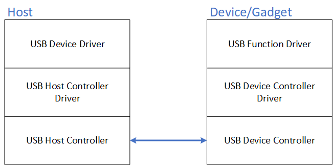

2025/08/07 00:10
# Gadget 框架
    分支
        dirver_raspberry_XXXXX_vX.X.X

    文件
        ./modules/app_XXX/app_XXX.c
        ./dirverModules/dirverModules/XXX.c

# 定义

目的是让 linux 设备模拟成 USB 设备，从而让 pc 主机 能够识别 出 来。

# 流程

要有各种 设备描述符
配置 描述符
接口 描述符
端点 描述符

# 执行顺序

# 内部机制

# Makefile
# # XXXX ---------------------
XXXX-y := $(MODULES_DIR)/XXXX/XXXX.o
obj-m := XXXX.o

# 执行命令

insmod
rmmod

chmod +x main

ps -ef | grep main
kill -9 PID

ls /proc/device-tree/
ls /sys/devices/platform/
dmesg | tail
cat /proc/devices  
cd /sys/class 

sources/linux-rpi-6.6.y/arch/arm/boot/dts/broadcom/bcm2710-rpi-3-b-plus.dts
make ARCH=arm64 CROSS_COMPILE=aarch64-linux-gnu- dtbs -j$(nproc) 

dtc -I fs /sys/firmware/devicetree/base | less
# 扩展

# 从 赢家软件角度理解 Gadget 框架
总结来说我就是没咋理解

