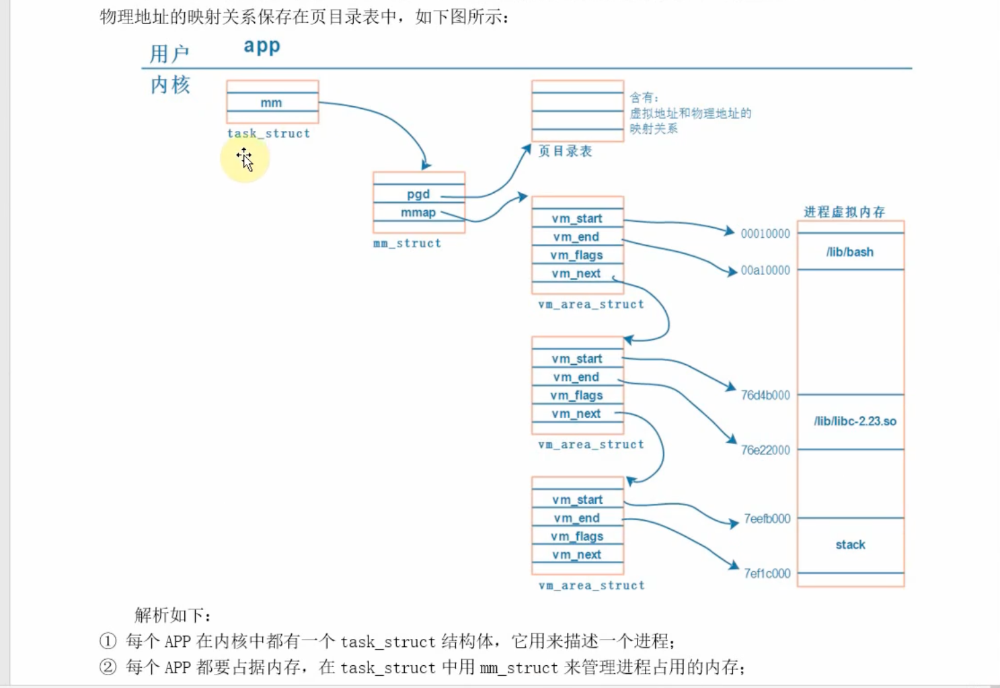
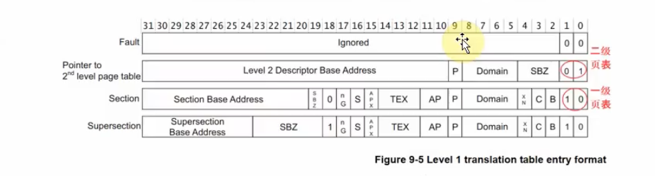
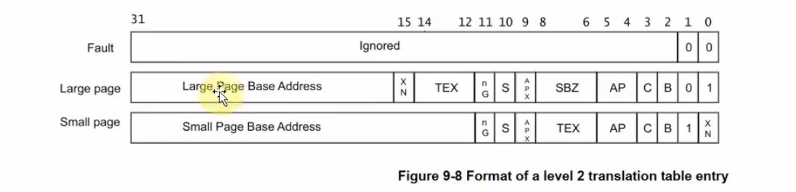

2025/03/30 21:00
# mmap 内存映射
    分支
        dirver_raspberry_XXXXX_vX.X.X

    文件
        ./modules/app_XXX/app_XXX.c
        ./dirverModules/dirverModules/XXX.c

# 定义


memory map

    1、应用程序 与驱动之间 传递数据，可以通过 read 和 write 函数进行，这涉及到 用户态的 buffer 和内核的 buffer 之间传数据；
        a: copy_from_user() 
        b: copy_to_user()

    2、应用程序 不能直接 读写 驱动程序中的buffer，需要在用户态 buffer 和 内核态 buffer 之间进行一次数据 拷贝。这种方式在数据量比较小的时候没什么问题，但是数据量比较大的时候效率就 太低了， 
       a: 例如 更新LCD 显示时，每一帧都通过 app 传给 内核，假设 LCD 采用 1024*768*4 = 3MB，那么每次更新都需要拷贝 3MB 数据，效率太低；
    
    3、改进的方式就是让 应用程序 直接读写 驱动程序的 buffer，这可以通过 mmap 实现（memory map ），把内核的 buffer 映射到用户态，让 App 在用户态直接读写；


APP 用户态程序 
    1、同一个  app 程序，在运行的时候 打印 变量 地址
        例如：int a = 0;  printf("a's address = 0x%lx, a's value = %d\n", (long unsigned int)&a, a);
        a 运行第一次 打印的值 和 运行第二次 打印的 值 是相同，打印的不是真实的 物理地址，打印的是 虚拟地址；
        b: 两个相同  app 储存变量的 物理地址 是相同的 


    2、在运行第一个程序 app1 的时候， cpu 发出的 v_addr 要 映射到 p_addr1 ， 运行 第二个程序 app2 的 时候 ，  v_addr 也要转换到 p_addr2 ，但是  p_addr1与 p_addr2 是 不同的
        a：虚拟地址 v_addr 到 物理地址  p_addr1 p_addr2 的转换需要 通过  MMU；


MMU 内存管理单元
    1、MMU 是 CPU 的一个组成部分，作用是 将  CPU 发送的 虚拟地址 转换为 物理地址；
    2、虚拟地址 和 物理地址 是一一对应的，所以 MMU 中的页表项 中的虚拟地址 和 物理地址 是一一对应的；
    3、对于不同的应用程序 转换方式不一样，所以 MMU 中有多个页表，每个应用程序对应一个页表；


应用程序 驱动程序 要访问同一块内存的时候
    1、通过 MMU
    2、驱动程序 里面 用到的 虚拟地址 drv_addr, 经过  MMU 将 drv_addr 转换为 p_addr
    3、应用程序 里面 用到的 虚拟地址 app_addr, 经过 MMU 将 app_addr 转换为 p_addr

    4、 应用程序 app 要去 访问  p_addr 的 内存， ，
        a: 首先要得到  app_addr；内核 会做 创建 虚拟地址，使用 内核函数，传入 0 或者传入一个地址 给 创建函数，如果传入的地址可以用那么，使用传入的 地址，不可以用 自动分配新地址
        b: 获得 p_addr； 如何获得 物理地址，需要驱动程序 去做！！！！！如何做？？？？？///
        e: map 映射 app_addr 到 p_addr； 这个也是 内核 提供的函数


    5、命令

            kingnan@raspberrypi:~ $ ps
                PID     TTY          TIME CMD
                999     pts/4       00:00:00 bash
                1289    pts/4       00:00:00 ps
            kingnan@raspberrypi:~ $ cat /proc/999/maps 
            557bc50000-557bd87000 r-xp 00000000 b3:02 1755                           /usr/bin/bash
            557bd9b000-557bda0000 r--p 0013b000 b3:02 1755                           /usr/bin/bash
            557bda0000-557bda9000 rw-p 00140000 b3:02 1755                           /usr/bin/bash


        root@raspberrypi:/home/kingnan/TEMP/pinctrl 子系统# ps -ef | grep main

        # 查看当前运行的进程，并过滤出包含main的进程
        root        1767    1682  0 09:39 pts/1    00:00:00 ./main /dev/my_gpio_threadedirq_0
        root        1843    1526  0 09:40 pts/0    00:00:00 grep main
        root@raspberrypi:/home/kingnan/TEMP/pinctrl 子系统# cat /proc/1767/maps
        5581a60000-5581a63000 r-xp 00000000 b3:02 254628                         /home/kingnan/TEMP/threadedirq/main        r-xp (可读、可执行，不能写) → 代码段
        5581a7f000-5581a80000 r--p 0000f000 b3:02 254628                         /home/kingnan/TEMP/threadedirq/main        r--p (可读，不能执行、不能写) → 只读数据段
        5581a80000-5581a81000 rw-p 00010000 b3:02 254628                         /home/kingnan/TEMP/threadedirq/main        rw-p (可读可写，不能执行) → 可写数据段（BSS、全局变量等）
        5589771000-5589792000 rw-p 00000000 00:00 0                              [heap]
        7f82c80000-7f82e07000 r-xp 00000000 b3:02 5543                           /usr/lib/aarch64-linux-gnu/libc.so.6
        7f82e07000-7f82e1c000 ---p 00187000 b3:02 5543                           /usr/lib/aarch64-linux-gnu/libc.so.6
        7f82e1c000-7f82e20000 r--p 0018c000 b3:02 5543                           /usr/lib/aarch64-linux-gnu/libc.so.6
        7f82e20000-7f82e22000 rw-p 00190000 b3:02 5543                           /usr/lib/aarch64-linux-gnu/libc.so.6
        7f82e22000-7f82e2f000 rw-p 00000000 00:00 0 
        7f82e32000-7f82e59000 r-xp 00000000 b3:02 5306                           /usr/lib/aarch64-linux-gnu/ld-linux-aarch64.so.1
        7f82e6b000-7f82e6d000 rw-p 00000000 00:00 0 
        7f82e6d000-7f82e6f000 r--p 00000000 00:00 0                              [vvar]
        7f82e6f000-7f82e70000 r-xp 00000000 00:00 0                              [vdso]
        7f82e70000-7f82e72000 r--p 0002e000 b3:02 5306                           /usr/lib/aarch64-linux-gnu/ld-linux-aarch64.so.1
        7f82e72000-7f82e74000 rw-p 00030000 b3:02 5306                           /usr/lib/aarch64-linux-gnu/ld-linux-aarch64.so.1
        7fe9162000-7fe9183000 rw-p 00000000 00:00 0                              [stack]
        root@raspberrypi:/home/kingnan/TEMP/pinctrl 子系统# 


        可以获得 当前进程使用的 虚拟地址空间

           5581a60000-5581a63000  放 应用程序 /home/kingnan/TEMP/threadedirq/main 的代码
           5581a7f000-5581a80000  放 应用程序 /home/kingnan/TEMP/threadedirq/main 的只读数据
           5581a80000-5581a81000  放 应用程序 /home/kingnan/TEMP/threadedirq/main 的可写数据
           5589771000-5589792000  [heap] 堆，代表的是 malloc()、new 等分配的 堆区， 进程启动时，堆区未分配，当程序调用 malloc()，brk() 或 mmap() 时，内核为进程分配堆空间，并在 /proc/<pid>/maps 中显示 [heap]， 当前程序中 没有  malloc() 、new 等分配的 堆区，所以没有 [heap]
           7f82c80000-7f82e07000  /usr/lib/aarch64-linux-gnu/libc.so.6  动态链接库
           7f82e32000-7f82e59000  /usr/lib/aarch64-linux-gnu/ld-linux-aarch64.so.1  动态链接库
           7fe9162000-7fe9183000  [stack] 栈，代表的是 函数调用时，分配的 栈区， 进程启动时，栈区未分配，当程序调用函数时，内核为进程分配栈空间，并在 /proc/<pid>/maps 中显示 [stack]， 

           7f82e6d000-7f82e6f000  [vvar]  vvar 是内核为每个进程维护的一个虚拟内存区域，用于存放与进程相关的内核数据，如进程的页表、进程的地址空间等，vvar 区域通常位于内核空间，进程无法直接访问
           7f82e6f000-7f82e70000  [vdso]  vdso 是内核为每个进程维护的一个虚拟内存区域，用于存放与进程相关的内核数据，如进程的页表、进程的地址空间等，vdso 区域通常位于内核空间，进程无法直接访问


```C
#include <stdio.h>
#include <unistd.h>
#include <stdlib.h>
 
int a;
int main(int argc, char **argv)
{
	if (argc != 2)
	{
		printf("Usage: %s <number>\n", argv[0]);
		return -1;
	}
	a = strtol(argv[1], NULL, 0);
	printf("a's address = 0x%lx, a's value = %d\n", (long unsigned int)&a, a);
	while (1)
	{
		sleep(10);
	}
	return 0;
}

```


    root@raspberrypi:/home/kingnan/TEMP/mmap# ./test 2
    
    a's address = 0x555b02004c, a's value = 2           // z这里 打印的 a 的地址，是虚拟地址，不是物理地址； 地址 是 0x555b02004c， 在  555b020000-555b021000 ，这个是数据段？ 


    root@raspberrypi:/home/kingnan# ps -ef | grep test
    root        1862    1097  0 15:07 pts/0    00:00:00 ./test 2
    root        1978    1907  0 15:07 pts/4    00:00:00 grep test

    root@raspberrypi:/home/kingnan# cat /proc/1862/maps 
    555b000000-555b001000 r-xp 00000000 b3:02 254604                         /home/kingnan/TEMP/mmap/test       r-xp (可读、可执行，不能写) → 代码段
    555b01f000-555b020000 r--p 0000f000 b3:02 254604                         /home/kingnan/TEMP/mmap/test       r--p (可读，不能执行、不能写) → 只读数据段
    555b020000-555b021000 rw-p 00010000 b3:02 254604                         /home/kingnan/TEMP/mmap/test       rw-p (可读可写，不能执行) → 可写数据段（BSS、全局变量等）
    558c1a9000-558c1ca000 rw-p 00000000 00:00 0                              [heap]                             
    7facbc0000-7facd47000 r-xp 00000000 b3:02 5543                           /usr/lib/aarch64-linux-gnu/libc.so.6    动态链接库
    7facd47000-7facd5c000 ---p 00187000 b3:02 5543                           /usr/lib/aarch64-linux-gnu/libc.so.6   
    7facd5c000-7facd60000 r--p 0018c000 b3:02 5543                           /usr/lib/aarch64-linux-gnu/libc.so.6
    7facd60000-7facd62000 rw-p 00190000 b3:02 5543                           /usr/lib/aarch64-linux-gnu/libc.so.6
    7facd62000-7facd6f000 rw-p 00000000 00:00 0 
    7facd71000-7facd98000 r-xp 00000000 b3:02 5306                           /usr/lib/aarch64-linux-gnu/ld-linux-aarch64.so.1
    7facdaa000-7facdac000 rw-p 00000000 00:00 0 
    7facdac000-7facdae000 r--p 00000000 00:00 0                              [vvar]                                  vvar 是内核为每个进程维护的一个虚拟内存区域，用于存放与进程相关的内核数据，如进程的页表、进程的地址空间等，vvar 区域通常位于内核空间，进程无法直接访问
    7facdae000-7facdaf000 r-xp 00000000 00:00 0                              [vdso]
    7facdaf000-7facdb1000 r--p 0002e000 b3:02 5306                           /usr/lib/aarch64-linux-gnu/ld-linux-aarch64.so.1
    7facdb1000-7facdb3000 rw-p 00030000 b3:02 5306                           /usr/lib/aarch64-linux-gnu/ld-linux-aarch64.so.1
    7fddd94000-7fdddb5000 rw-p 00000000 00:00 0                              [stack]                          栈，代表的是 函数调用时，分配的 栈区， 进程启动时，栈区未分配，当程序调用函数时，内核为进程分配栈空间，并在 /proc/<pid>/maps 中显示 [stack]，
    root@raspberrypi:/home/kingnan# 

    p = private 私有的
    s = shared  共享的


    1. 为什么 /home/kingnan/TEMP/mmap/test 在虚拟内存中出现了三次？物理内存中也是三次吗？为什么 555b020000-555b021000 既能存程序也能存变量？为什么虚拟内存中有三个区域？
        在 /proc/1862/maps 中，您的可执行文件 /home/kingnan/TEMP/mmap/test 被映射为三个不同的内存区域：

        555b000000-555b001000 r-xp：这是代码段（text segment），包含程序的可执行指令。r-xp 表示可读、可执行，但不可写，且是进程私有的。
        555b01f000-555b020000 r--p：这是只读数据段（read-only data），存放初始化的常量数据（例如字符串 "Usage: %s <number>\n"）。它可读但不可写或执行。
        555b020000-555b021000 rw-p：这是数据段（data segment），存放初始化的全局变量和静态变量（例如您的 int a）。rw-p 表示可读可写，但不可执行。
        这三个区域的出现是因为 ELF 可执行文件（您的 test 程序）被分为不同的段（.text、.rodata、.data 等），加载器将它们映射到虚拟内存中，并分配不同的权限。这是为了安全性（例如防止代码被改写）和内存管理的需要。

        物理内存中也有三份吗？
        不一定。虚拟内存的映射并不意味着物理内存中有三份独立的内容：

        代码段（r-xp）：通常由磁盘上的文件支持，并且在运行同一程序的多个进程间共享物理页面。例如，多次运行 ./test，它们的代码段可能指向相同的物理内存。
        只读数据段（r--p）：同样由文件支持，也可以在进程间共享。
        数据段（rw-p）：这是每个进程私有的。如果您修改了 a 的值（例如在循环中赋值），会触发写时复制（copy-on-write），为该进程分配独立的物理页面。但在初始状态下，它可能与文件共享物理页面，直到发生修改。
        因此，物理内存中，只读部分（代码和只读数据）通常只有一份，而可写的数据段在修改后会为每个进程分配独立的物理页面。

        为什么 555b020000-555b021000 既能存程序也能存变量？
        实际上，555b020000-555b021000 只存放变量，不存放“程序”（即代码）。代码位于 555b000000-555b001000 中。您的输出显示 a 的地址是 0x555b02004c，属于 555b020000-555b021000，这是数据段，专门用于存储像 a 这样的全局变量。之所以有误解，可能是因为您把“程序”想象成了一个整体——现代系统将代码和数据分开，以提高安全性和效率（例如 W^X 策略：写和执行互斥）。


    2. 在 Raspberry Pi 3B+ 的 64 位地址下，555b020000-555b021000 如何通过页表映射？对应哪个页表项？
        虚拟到物理的映射
        Raspberry Pi 3B+ 使用 ARMv8-A 架构的 64 位模式（AArch64）。虚拟地址如 0x555b020000 通过多级页表转换为物理地址。我们假设 Linux 使用常见的 4KB 页面大小：

        页面大小：4KB（12 位偏移）。
        地址分解：对于 4KB 页面，64 位虚拟地址分为：
        偏移量：第 0–11 位（12 位，4KB）。
        PTE（页表项）：第 12–20 位（9 位）。
        PMD（页面中间目录）：第 21–29 位（9 位）。
        PUD（页面上层目录）：第 30–38 位（9 位）。
        PGD（页面全局目录）：第 39–47 位（9 位）。
        更高位（48–63）根据配置可能是符号扩展或未使用（例如 48 位虚拟地址空间）。
        对于 0x555b020000：

        十六进制：0x555b020000 → 二进制：0101 0101 0101 1011 0000 0010 0000 0000 0000 0000。
        PGD 索引：第 39–47 位 = 0b010101010 = 170。
        PUD 索引：第 30–38 位 = 0b10111 = 23。
        PMD 索引：第 21–29 位 = 0b00000010 = 2。
        PTE 索引：第 12–20 位 = 0b000000000 = 0。
        偏移量：第 0–11 位 = 0x000 = 0。
        0x555b020000 正好是 4KB 页面边界对齐的起始地址。页表查找从进程的 PGD 开始，索引 170 → PUD[23] → PMD[2] → PTE[0]，最终指向一个物理页面框架。

        对应哪个页表项？
        具体的物理地址取决于内核的分配，无法直接从 /proc/<pid>/maps 看到（它只显示虚拟地址）。要确定精确映射：

        使用 /proc/1862/pagemap（需要 root 权限和内核支持）查询 0x555b020000 的物理页面框架号（PFN）。
        PTE[0]（在 PMD[2] 中）保存物理页面地址及属性（例如 rw-p 权限）。
        没有 pagemap 数据，我们无法给出确切的物理地址，但它是一个为数据段分配的 4KB 页面。

        结束地址减去起始地址：
            0x555b021000 - 0x555b020000 = 0x1000
        0x1000 是十六进制，表示 4096 字节（因为 0x1000 = 2^12 = 4096）。在计算机系统中，4096 字节等于 4KB。

    3. [heap] 存的是什么？
        [heap] 区域（558c1a9000-558c1ca000 rw-p）是进程的堆内存，用于动态内存分配：

        通过 malloc()、calloc() 或 realloc() 等函数分配内存。
        堆会根据需要向上增长（地址变高），由 C 标准库（例如 glibc）通过 brk 或 mmap 系统调用管理。
        您的程序未使用动态分配，因此堆可能很小或未被使用，但系统仍会预留此区域。
        堆中存储运行时分配的数据，例如动态数组或结构。


    4. [vvar]、[vdso] 和 [stack] 是什么？存的是什么？
        ** [vvar] (7facdac000-7facdae000 r--p)**
        用途：虚拟变量页面，由内核提供，只读。
        内容：存储系统调用（如 gettimeofday() 或 clock_gettime()）所需的数据，避免进入内核态。
        目的：提高性能，将内核管理的变量（例如时间）暴露给用户空间。
        ** [vdso] (7facdae000-7facdaf000 r-xp)**
        用途：虚拟动态共享对象，内核提供的库。
        内容：快速系统调用的可执行代码（例如 gettimeofday()）。
        目的：在用户空间运行，避免系统调用开销，自动映射到每个进程。
        ** [stack] (7fddd94000-7fdddb5000 rw-p)**
        用途：进程的调用栈。
        内容：局部变量、函数调用框架、返回地址以及 main() 和嵌套调用的参数。
        行为：栈向下增长（从高地址到低地址）。
        这些是 Linux 进程内存布局的标准区域，各有特定作用。


    5. 为什么 /usr/lib/aarch64-linux-gnu/ld-linux-aarch64.so.1 出现了多次？指向相同的物理地址吗？有什么用？
    多个区域
    动态链接器/加载器（ld-linux-aarch64.so.1）有几个段：

    7facd71000-7facd98000 r-xp：代码段，包含链接器的逻辑。
    7facdaf000-7facdb1000 r--p：只读数据（常量、元数据）。
    7facdb1000-7facdb3000 rw-p：可写数据（链接器使用的变量）。
    其他小区域（例如 7facdaa000-7facdac000 rw-p）：额外的 BSS 或数据段。
    与您的 test 文件类似，这些反映了 ELF 文件的各个部分，具有不同的权限。

    指向相同的物理地址吗？
    只读段（r-xp、r--p）：由文件支持，多个进程共享相同的物理页面。除非被修改（r--p 很少发生），它们通常指向同一物理地址。
    可写段（rw-p）：每个进程私有。如果有修改（例如重定位数据），会触发写时复制，为每个进程分配独立的物理页面。
    用途
    代码（r-xp）：执行动态链接，解析符号（例如 printf 来自 libc.so.6）。
    数据（r--p、rw-p）：存储链接器状态、符号表和运行时数据。
    动态链接器被映射到每个动态链接的进程中，管理库依赖。


物理地址的映射关系保存在页目录表中


    1、在 linux 系统中，每一个应用程序 在内核里都有一个 task_struct 结构体
    2、task_struct 结构体 这个结构体里有一个 mm_struct 结构体，叫做 mm， 
    3、mm_struct 结构体 ， mm_struct 描述 进程使用的 内存 mmap，mm_struct 既描述 虚拟地址  如何映射到 物理地址 pgd
        a: 里有一个 pgd 指针，指向第一级页表(页目录)，含有 虚拟地址和物理地址 映射的关系； 使用一个页目录表，使用这个页目录表就可以把 一块 虚拟内存 映射到 物理内存
        b: 里有一个 mmap 指针，指向一个 vm_area_struct 结构体，这个结构体是链表结构，用来描述虚拟内存空间；每一个链表项 都代表 一块虚拟内存； 内核会帮忙 构造好 这一项

            1、首先 这里 是一个 链表，用来描述虚拟内存空间，链表的每一个 元素 是 vm_area_struct 结构体
            2、这里的 vm_start 和 vm_end 是虚拟内存空间的起始地址和结束地址； 例如 555b000000-555b001000 r-xp 00000000 b3:02 254604                         /home/kingnan/TEMP/mmap/test
            3、 链表项 中的  vm_start  和 vm_end 指向 的 进程虚拟内存 ， 要映射到 哪一个物理地址去，由 pgd 这个 结构体描述
```C

struct vm_area_struct {
    unsigned long vm_start;       /* 虚拟内存空间的起始地址 */
    unsigned long vm_end;         /* 虚拟内存空间的结束地址 */
    struct vm_operations_struct *vm_ops; /* 虚拟内存空间操作函数 */
    unsigned long vm_flags;       /* 虚拟内存空间的标志 */
    struct mm_struct *vm_mm;      /* 指向 mm_struct 结构体 */
    void *vm_private_data;        /* 私有数据 */
    struct rb_node vm_rb;         /* 红黑树节点，用于管理虚拟内存空间 */
    struct list_head anon_vma_chain; /* 匿名虚拟内存空间链表 */
    struct anon_vma *anon_vma;    /* 匿名虚拟内存空间 */
    struct file *vm_file;         /* 文件指针，指向映射的文件 */
    pgoff_t vm_pgoff;             /* 文件偏移量 */
    unsigned long vm_reserved1;    /* 保留字段 */
    unsigned long vm_reserved2;    /* 保留字段 */

};

// sources/linux-rpi-6.6.y/include/linux/mm_types.h
struct vm_area_struct {
	/* The first cache line has the info for VMA tree walking. */
	union {
		struct {
			/* VMA covers [vm_start; vm_end) addresses within mm */
			unsigned long vm_start;
			unsigned long vm_end;
		};
		struct rcu_head vm_rcu;	/* Used for deferred freeing. */
	};

	struct mm_struct *vm_mm;	/* The address space we belong to. */
	pgprot_t vm_page_prot;          /* Access permissions of this VMA. */
	union {
		const vm_flags_t vm_flags;
		vm_flags_t __private __vm_flags;
	};
	int vm_lock_seq;
	struct vma_lock *vm_lock;
	/* Flag to indicate areas detached from the mm->mm_mt tree */
	bool detached;
	struct {
		struct rb_node rb;
		unsigned long rb_subtree_last;
	} shared;
	struct list_head anon_vma_chain; /* Serialized by mmap_lock & * page_table_lock */
	struct anon_vma *anon_vma;	/* Serialized by page_table_lock */
	/* Function pointers to deal with this struct. */
	const struct vm_operations_struct *vm_ops;
	/* Information about our backing store: */
	unsigned long vm_pgoff;		/* Offset (within vm_file) in PAGE_SIZE units */
	struct file * vm_file;		/* File we map to (can be NULL). */
	void * vm_private_data;		/* was vm_pte (shared mem) */
	struct anon_vma_name *anon_name;
	atomic_long_t swap_readahead_info;
	struct vm_region *vm_region;	/* NOMMU mapping region */
	struct mempolicy *vm_policy;	/* NUMA policy for the VMA */
	struct vma_numab_state *numab_state;	/* NUMA Balancing state */
	struct vm_userfaultfd_ctx vm_userfaultfd_ctx;
} __randomize_layout;


```

            
        c: 里有一个 mm_rb 指针，指向一个红黑树，用来描述虚拟内存空间


内存映射

    1、Arm 架构支持一级页表映射，也就是说MMU 根据CPU发来的虚拟地址可以找到第 1 个页表，从第一个页表里就可以知道这个虚拟地址对应的物理地址； 一级页表里地址映射的最小单元是 1M;
    2、Arm 还支持二级页表映射，也就是说MMU 根据CPU发来的 虚拟地址找到第 1 个 页表，从第一个页表里就可以知道第2级页表在哪里，再取出 第2 级页表，从第2个页表里才能确定这个虚拟地址对应的物理地址，耳机页表地址映射的最先单位 有 4K 、1K ， linux 系统默认使用 4K 的映射单元； 好像还有大页表 是  64 K

    3、一级页表项里的内容，决定了它指向一块物理内存，还指向 二级页表


    Section Base Address 是 物理地址

    映射原理 
        1、一级页表中每一个 页表项 用来设置 1M 的 空间，对于 32 位的系统，虚拟地址空间有 4G， 4G/1M = 4096， 需要4096个 页表项，所以 一级页表有 4096 个页表项，每一个页表项 4 字节，所以 一级页表占用 16K 的空间
        2、第 0 个页表项用来 表示虚拟地址的 第0个1M (虚拟地址为 0x0000000～0x1FFFFFF)，对应 是哪一块物理内存，是有一些权限设置，例如可读可写，可执行，可共享等
        3、第 1 个页表项用来 表示虚拟地址的 第1个1M (虚拟地址为 0x1000000～0x1FFFFFF)，对应 是哪一块物理内存，是有一些权限设置，例如可读可写，可执行，可共享等

        4、使用一级页表时，现在内存里设置好各个页表项，每一个页表项里设置好物理地址，然后把页表基地址 告诉 MMU，然后 MMU 根据虚拟地址，就可以找到对应的物理地址了

    一级 映射过程
        1、 CPU 发出虚拟地址 V_addr 假设为 0x12345678
        2、 MMU 根据 V_addr 的第 20~31 位， V_addr[31:20] 找到一级页表项；       0x12345678[31:20] = 0x0000001F
            虚拟地址 0x12345678  是虚拟地址空间里 第 0x123 个1M， 所以 MMU 根据 0x123 找到一级页表里的 第 0x123 个页表项，知道他是 一级页表项 ； 0x123 * 4 = 0x4C4
                偏移量是 0x45678
        3、假设从这个表里 取出的物理基地址 Section Base Address, 为 0x80000000
        4、物理基地址 加上 段内偏移量 0x45678，得到 物理地址 0x80004567
        5、MMU 根据 物理地址 0x80004567，找到 物理内存里的数据，返回给 CPU


    二级 映射过程
        1、 CPU 发出虚拟地址 V_addr 假设为 0x12345678
        2、 MMU 根据 V_addr 的第 20~31 位， V_addr[31:20] 找到一级页表项；       0x12345678[31:20] = 0x0000001F
            虚拟地址 0x12345678  是虚拟地址空间里 第 0x123 个1M， 所以 MMU 根据 0x123 找到一级页表里的 第 0x123 个页表项，知道他是 二级页表项，判断 二级 列表项  ； 有可能是  1K

        3、从这个表项里取出地址，假设是 address ，这表示 的是 二级页表项的物理地址
        4、V_addr[19:12]表示二级表项中的 索引 index 即 0x45，在二级页表项 中找到 第 0x45 项， 4K 的 空间基地址；

        5、里面含有4K 或 1K 物理地址的 基地址 page base address ，假设为 0x80000000

        6、V_addr[11:0]表示 物理地址的 偏移量 offset 即 0x78，物理地址 = page base address + offset = 0x80000000 + 0x78 = 0x80000078

        7、MMU 根据 物理地址 0x80000078，找到 物理内存里的数据，返回给 CPU

    


    1、cpu 根据 V_addr 从 MMU 中获得 物理地址，要把页表 告诉 MMU，MMU 才能根据 V_addr 找到 物 理地址， 页表 是存在 物理内存里的，所以页表 也有一个物理地址，这个物理地址 是由 MMU 告诉 CPU 的，CPU 把这个物理地址 告诉 MMU，MMU 就知道页表在哪里了
    2、 页表里面会有 很多个 页表项， 一个页表项 占据 32 位 也就是 4 个字节，有 一级页表项 ，也有二级页表项
        a: 一级页表项里面 保存有 Section Base Address 物理地址 ，这个物理地址就 对应 1M 的 内存


    mmap 调用过程
        1、从上面内存映射的过程可以知道，要给APP 开辟一块 虚拟内存，并且让它指向某块内存 buffer，
            a: 得到一个 vm_area_struct 结构体，他表示 App 的一块虚拟内存空间；App 调用 mmap 系统函数的时，内核会 自动创建一个 vm_area_struct 结构体，这个结构体里保存有 虚拟内存空间的信息，例如虚拟内存空间的起始地址，虚拟内存空间的结束地址，虚拟内存空间的权限，虚拟内存空间对应的物理内存地址等
            b: 确定物理地址：
                1、你想映射某个内核 buffer，你需要 得到的 它的物理地址， 我要如何得到 物理地址？？？？
            c: 给 vm_area_struct 结构体 和 物理地址建立映射关系
                1、app 使用 mmap(addr, length, prot, flags, fd, offset) 系统函数，addr 是 app 希望使用的 虚拟内存空间的起始地址，length 是虚拟内存空间的长度，prot 是虚拟内存空间的权限，flags 是虚拟内存空间的标志，fd 是文件描述符，offset 是文件偏移量;
                    a: 内核会判断 addr 是否为 NULL，如果为 NULL ，或者 不能用 ，内核会自动分配一个虚拟内存空间的起始地址，否则使用 addr 作为虚拟内存空间的起始地址
                2、内核会根据 fd 和 offset 找到对应的 buffer，然后根据 buffer 的物理地址，找到对应的 vm_area_struct 结构体，然后把 vm_area_struct 结构体 和 buffer 的物理地址 建立映射关系
                3、内核会根据 addr 和 length，找到对应的 vm_area_struct 结构体，然后把 vm_area_struct 结构体 和 buffer 的物理地址 建立映射关系

                    在创建过程中 会分配一个 vma_area_struct 结构体， 用来描述一块虚拟空间
                    vma_area_struct vm = kmem_cache_zalloc(vm_area_cach， GFP_KERNEL);

                    会对 vm  设置一些属性 ，
                    例如 
                        vm->vm_flags = flags;// 可读 可执行 共享 私有
                        vm->vm_page_prot = vm_get_page_prot(flags); //  使用 cache 还是 buffer

                    最后会调用 驱动程序的 mmap
                    file ->f_op->mmap(file, vma);


                4、 用户只需要 实现 驱动的 mmap() 函数
                    a: 提供物理地址， 如何提供物理地址
                    b: 设置属性 ： cache，buffer
                    c: 给 vm_area_struct 结构体 和 物理地址 建立映射关系


 
     


在 rpi3B+ 中
    页表项
        1、分四级
            PGD（Page Global Directory）页面全局目录；全局目录，进程的页表根，覆盖 1GB/条目                  PGD：第 39–47 位（170），查找 PGD[170] → PUD 地址。
            PUD（Page Upper Directory） 页面上层目录；上层目录，连接 PGD 和 PMD，覆盖 1GB 或 2MB。          PUD：第 30–38 位（23），查找 PUD[23] → PMD 地址。
            PMD（Page Middle Directory）页面中间目录；中间目录，连接 PUD 和 PTE，覆盖 2MB 或 4KB。          PMD：第 21–29 位（2），查找 PMD[2] → PTE 地址。
            PTE（Page Table Entry）     页表项；页表项，直接映射 4KB 物理页面。                            PTE：第 12–20 位（0），查找 PTE[0] → 物理页面地址（例如 0x12345000）。
            
            偏移：第 0–11 位（0x4c），物理地址 = 0x12345000 + 0x4c = 0x1234504c。


            这些层级共同完成虚拟地址到物理地址的翻译，层数取决于页面大小和虚拟地址空间配置（例如 4KB 页面在 48 位 VA 下是 4 级）

            PGD  里有 512 个，每一个 8 字节，所以 PGD 占用 512 * 8 = 4K 的空间； PGD 可以存储 512 个条目，每个条目是一个 64 位值，通常指向下一级页表（PUD 或 PMD）的物理地址


ARM 的 cache 和写缓冲器 buffer

   

    1、使用mmap 时 需要 cache 、 buffer
        a: cache 是一块 高速内存, 一般只有 几MB 或者 几十 MB
            1、对于读操作，cpu 处理的速度非常快， 但是内存的读写速度非常慢，所以 cpu 和 内存之间 有一个 cache，cache 是一块高速内存，cpu 和 内存之间 的数据传输 都是通过 cache 进行的，cache 是由 cpu 和 内存 共享的，cpu 和 内存 都可以访问 cache，但是 cpu 优先访问 cache，如果 cache 里没有数据，cpu 就会去内存里读取数据，然后把数据存入 cache，这样 cpu 就可以快速访问数据了; 先读给cache 再读给 cpu;
            2、 在读的 过程， 如果 说 cpu 要读一个 int i; cpu 不仅仅会把 i 读出来，还会把 i 周围的数据都读出来，因为 cpu 访问内存的速度非常慢，所以 cpu 会尽量减少访问内存的次数，所以 cpu 会把 i 周围的数据都读出来，这样 cpu 就可以快速访问 i 了，这就是 cache 的局部性原理;
            3、 一般 会读 4K 的数据，因为 4K 是一个 cache line，所以 cpu 会把 i 周围的数据都读出来，这样 cpu 就可以快速访问 i 了，这就是 cache 的局部性原理;
        b: buffer 写缓存器，相当于一个 FIFO 可以把多个写操作集合起来一次写入内存;
            1、对于写操作, cpu 会将数据 写入 cache，新的 数据放入到 cache 以后， cpu 就不再管了，cache 会慢慢的把数据 写入到内存，在这个过程中 ，cache 会 与 buffer 进行交互，把数据写入到 buffer，buffer 会把数据写入到内存，这样 cpu 就可以继续执行其他的操作了，不需要等待数据写入到内存，提高了 cpu 的效率; cache 先写给 buffer 再写给内存， buffer 与内存的写速度 是低速 的
            2、写操作的三条路径
                a、第一种 cpu 创建了新数据，先写入 cache, 如果 立刻写入到的 内存的话，这种方式叫 write through （写通），不经过 buffer
                b、第二种方式 ， cpu创建了新数据，先写入 cache，但是这些新数据并不着急 写到 内存上，只是保存到 cache 上， 把对应的 cache内的 一行数据 标为 脏！！， 当 cache 满了之后，需要把这些 脏数据 ，调换出去的时候 才 写入 到内存， 这种方式叫做 write back （写回），这里的 wirte back 会用到 写缓存器 buffer ， 这个 cache 的 速度会特别快，不会等待 写缓存器 buffer 去写完， 也就是 cache 会把数据 丢给 写缓冲器 ，再由 写缓冲器 慢慢的 写入 到内存；这种情况下 cache 会和 内存的数据不一致
                    1、例如：DMA 把数据 DMA 把数据从 内存搬运的 网卡，这个时候 就要CPU 执行明亮先把数据从 cache 刷到内存，反过来也是一样， DMA 从网卡 中得到了新的数据在内存里 ，CPU 读数据在之前把 cache中的 数据丢器

                C、cpu 不实用 cache ，而是使用buffer，由 buffer 来完成 缓慢的写操作
                    1、假设 使用 
                        str R0, [R1, #0] // 将寄存器 R0 的值写入到内存地址 R1 所指向的位置

                        如果 使用 buffer 就可以 不用等待， 由 buffer 来完成 缓慢的写操作 ， 写合并 ，使用 这种方式 会有一些情况发生，就是 如果 cpu是想 逐个操作 写入内存 的 1 2 3 4 ，那么在使用 buffer 的时候，buffer 会把 1 2 3 4，合并成 一次操作 从写 4 个 byte，变成写 1个 word 


    2、 在使用读写的过程中 会使用 cache 和 buffer，但是在操作硬件寄存器的时候，如果仅仅是写入到 cache 是不会生效的，所以才 使用 mmap 的时候 要考虑到 是否要使用 cache，是否使用buffer
    

    3、在程序运行时 有 局部性原理
        a: 时间局部性
            某个时间点访问了储存器的特定位置，很可能在一小段时间里，会反复地访问这个位置；
        b: 空间局部性
            某个时间点访问了储存器的特定位置，很可能在不久的将来，会访问这个位置附近的储存器位置；

        c: 所以 cache 和 buffer 是为了提高 空间局部性和 时间局部性，减少访问内存的时间，提高程序运行速度；


App 或驱动 把一个值写入到 寄存器的流程； value => register
    1、这个过程中，cpu 是无法分辨 访问寄存器 和 访问内存的，因为都是操作 访问 某个地址，寄存器 的 地址 是 映射 到内存
    2、 在整个过程中
        a: App 有可能 会把这个值写入 cache
        b: 在若干时间之后 才会放入到寄存器
        c: 所以在使用寄存器的时候要避免使用到 cache

    3、cpu 在 写入数据 到 显存（FrameBuffer） 中的时候 也不适合使用 cache，因为显卡要 使用 到这个数据
    4、DMA : 我记得是 数据搬运，stm32 上有用过； cpu 产生的数据放到 内存中， 有其他 硬件 可以直接访问 这块内存区域，硬件 得到新的数据，不经过 cpu , DMA 是个硬件功能，不适合 时影 cache
        a、 比如说DMA 直接 把数据 放到 声卡上，这时候要保证 cpu 的新数据直接到达这块区域
    


cache
    cahe 空间有限 大概 4MB，但是 
    cpu 与 内存 之间有 一个 cache

    cpu - cache - 内存

    1、一般的 内存变量 使用 cache

    空间 

buffer


# 流程


# 执行顺序


# 内部机制


# Makefile
# # XXXX ---------------------
XXXX-y := $(MODULES_DIR)/XXXX/XXXX.o
obj-m := XXXX.o


# 执行命令


insmod
rmmod

chmod +x main

ps -ef | grep main
kill -9 PID

ls /proc/device-tree/
ls /sys/devices/platform/
dmesg | tail
cat /proc/devices  
cd /sys/class 


# 扩展

