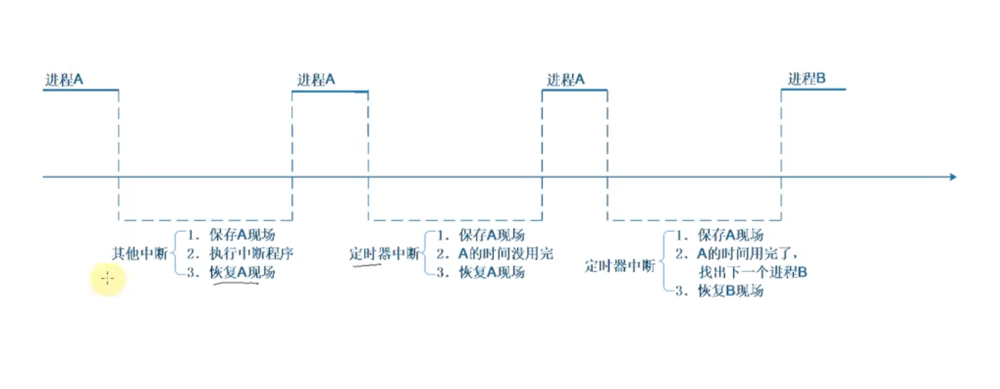

2025/03/21 21:13
    分支
        dirver_raspberry_input_button_v0.1.2

1、中断概念及处理流程

    中断是一种 异常，中断 一般不要持续很长时间
    
    异常向量表
        _start: b reset
        ldr pc, _undefind_instruction
        ldr pc, _software_interrupt
        ldr pc, _prefetch_abort
        ldr pc, _data_abort
        ldr pc, _not_used
        ldr pc, _irq// 发生中断时， cpu 跳到这个地址执行该指令 ，地址为 0x18
        ldr pc, _fiq

    中断向量表的地址
        0x00000000
        0x00000004
        0x00000008
        0x0000000c
        0x00000010
        0x00000014
        0x00000018
        0x0000001c

    异常向量表， 每一条指令对应一种异常
    发生复位时，cpu 跳转到 0x00000000 执行指令，就去执行第一条指令 b reset
    发生未定义指令时，cpu 跳转到 0x00000004 执行指令，就去执行第二条指令 ldr pc, _undefind_instruction
    发生软件中断时，cpu 跳转到 0x00000008 执行指令，就去执行第三条指令 ldr pc, _software_interrupt
    发生预取指令异常时，cpu 跳转到 0x0000000c 执行指令，就去执行第四条指令 ldr pc, _prefetch_abort
    发生数据访问异常时，cpu 跳转到 0x00000010 执行指令，就去执行第五条指令 ldr pc, _data_abort
    发生未使用异常时，cpu 跳转到 0x00000014 执行指令，就去执行第六条指令 ldr pc, _not_used
    发生中断时，cpu 跳转到 0x00000018 执行指令，就去执行第七条指令 ldr pc, _irq
    发生快速中断时，cpu 跳转到 0x0000001c 执行指令，就去执行第八条指令 ldr pc, _fiq

    这些指令存放的位置时固定的， 比如 对于ARM9 芯片 中断向量的地址是0x18
    发生中断时，CPU 就会强制跳去执行 0x18 地址的 代码
    在向量表里， 一般都是放置 一条跳转指令，发生该异常时，CPU 就会 执行向量表中的 跳转指令，去调用更复杂的函数

    当然，向量表的位置并不总是从地址0x00000000开始，很多芯片可以设置某个vector base寄存器 指定向量表在其他位置；
    但表中的哥哥异常向量的偏移地址是固定的， 复位向量偏移地址是 0. 中断时 0x18

2、进程 线程 中断 的核心： 栈

    中断正在运行的进程 线程

    1、在 cpu 中 有 寄存器 , 从栈中读取 a 和 b 的数据， 放到cpu 的寄存器中，将 a 和 b 的数据 在cpu中 相加，将结果保存到 a 再写入到 栈 里
    2、使用汇编指令 将数据读入cpu 的寄存器
    3、当程序执行到中断指令时，cpu 会将当前寄存器的值保存到 栈 中， 保存现场，然后跳转到中断处理程序
    4、中断处理程序执行完毕后，将寄存器的值从 栈 中恢复，然后继续执行被中断的程序

    中断处理程序

    在 linux 中 ， 资源分配的单位是进城，调度的单位是线程
        一个进程里 可以有多个线程，这些线程共用 打开的文件句柄、全局变量 等
        线程之间 相互独立 ，同时运行，也就是说，每一个线程 都有自己的栈

3、linux 系统对中断处理的演进
    1、在linux中，中断是不可以被另一个优先级更高的中断打断的
    2、不能 中断嵌套， 如果不断嵌套容易导致 栈 不够用；（我的 问题是 stm32f103C8T6 为什么 可以中断 嵌套）
    3、对于中断的处理要越快越好
    4、 调用 request_irq() 函数，将中断注册到内核中，并设置中断处理函数
    5、对于耗时 的中断，如果是 多核，可以将其放到内核线程中执行，这样就可以在 中断处理函数 中快速返回，而不会阻塞中断处理函数
    6、一般分为两种范式处理
        a：在进行一部分必要的硬件中断 后放到 软中断里， 也就是分为 上半部 下半部 ； 在硬件中断处理完之后 会去触发软中断
            1、中断的上半部： 处理紧急的事情，此时无法处理其他中断 ， 硬件中断： 按键中断、网卡中断
                硬件中断数组
                    每个 编号的 中断元素 里会有 一个 元素，比如说对于 A 号中断 可以放一个 irq_functionA ，放发生中断的时候 ，系统会算出 中断号， 使用中断号里的 irq_functionA 处理中断
            2、中断的下半部： 在开中断下处理 非紧急 的事情此时 会被 中断打断， 软件中断
                软件中断数组： softirq_veq 
                    每一个 数组项 包含 一个函数，还有一个 flag ，记录是否发生了， 可以 手动修改flag， 如果 把 某一个 flag 设置为 1 ，那么这个函数很快就会被执行，至少10ms 之后 就会被执行
                    软件中断 一般都是 处理完硬件中断 顺便 处理 软件中断
                    
            3、 被中断打断的 中断下半部，会在中断处理函数执行完毕后，恢复现场，再次执行

            4、 中断下半部 也变成一个线程 ，让这个线程 跟用户程序一起参与 调度， 大家都有机会执行；
                a: 内核 会自动创建一个 worker 线程， 称之为 内核线程；这里只是 创建一个 内核线程
                b: 在这个内核线程里面 会有一个 workqueue 队列，当 想让这个线程 来执行某些工作时，需要往这个队列里面 放入 一个结构体 work ，这个结构体 里有一个 函数指针，指向 需要执行的函数
                c: 如果想用这个内核线程 来 处理中断下半部， 工作队列
                    1、构一个 work， work中有 .function
                    2、当发生中断时 中断的上半部处理 的一些 紧急事之后
                    3、把这个 work 放入到 workqueue 队列中 （需要调用 schedule_work 函数，将 work 放入队列，）
                    4、 等 有机会执行这个函数的 时候 ，就会从 work 函数 中取出 ，然后这个内核线程 就会执行这个函数
                    5、这个内核线程和普通程序就会 在一起 都有机会 执行
            
            5、 线程化 中断 threaded irq； request_threaded_irq() 函数 可以传入 上半部 handler ，  thread_fn 线程函数，在线程里运行 
                a: 当前 cpu 可能 有多核
                b: 工作队列 运行在某一个 核上 ， 假设有100 个中断 ，这一百个中断都使用工作队列， 拥挤在 一个核里
                c: 每一个 中断 都创建一个 内核线程， 这样就可以在 多核上 运行，每个核上都有一个线程，这样就不会拥挤了

            eg： 看盘连接cpu 当按下键盘的时候 就会产生中断，在中断服务程序里面 会 做两件事情：
                1、（上半部）发命令清除中断， 耗时短， 免得不断发出中断，因为不能一直 处于中断状态
                2、（下版部）读键盘回去按键值，耗时长

                一般来说 系统内核 每 10ms 就会调用一次定时器中断

        
        b: 内核线程 来处理中断，内核线程 跟一般的 应用程序 是类似的， 都是 轮流执行，在内核线程处理中断的 过程中， 其他应用程序也可以执行，这样系统就不会卡顿了
            1、 中断下半部 也变成一个线程 ，让这个线程 跟用户程序一起参与 调度， 大家都有机会执行
                a: 内核 会自动创建一个 worker 线程， 称之为 内核线程； 这里只是 创建一个 内核线程
                b: 在这个内核线程里面 会有一个 workqueue 队列，当 想让这个线程 来执行某些工作时，需要往这个队列里面 放入 一个结构体 work ，这个结构体 里有一个 函数指针，指向 需要执行的函数
                c: 如果想用这个内核线程 来 处理中断下半部， 工作队列
                    1、构一个 work， work中有 .function
                    2、当发生中断时 中断的上半部处理 的一些 紧急事之后
                    3、把这个 work 放入到 workqueue 队列中 （需要调用 schedule_work 函数，将 work 放入队列，）
                    4、 等 有机会执行这个函数的 时候 ，就会从 work 函数 中取出 ，然后这个内核线程 就会执行这个函数
                    5、这个内核线程和普通程序就会 在一起 都有机会 执行
        

        c: 线程化 中断 threaded irq

 

    软件中断
        enum{
            HI_SOFTIRQ=0,
            TIMER_SOFTIRQ,
            NET_TX_SOFTIRQ,
            NET_RX_SOFTIRQ,
            BLOCK_SOFTIRQ,
            BLOCK_IOPOLL_SOFTIRQ,
            TASKLET_SOFTIRQ, // tasklet 软件中断
            SCHED_SOFTIRQ,
            HRTIMER_SOFTIRQ,
            RCU_SOFTIRQ,
            NR_SOFTIRQS
        };
