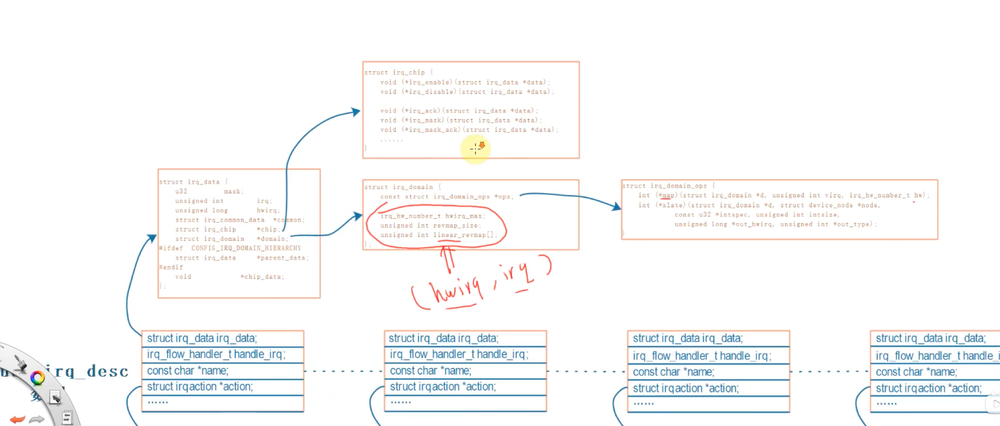

2025/03/21 21:13
    分支
        dirver_raspberry_input_button_v0.1.2

1、中断概念及处理流程

    中断是一种 异常，中断 一般不要持续很长时间
    
    异常向量表
        _start: b reset
        ldr pc, _undefind_instruction
        ldr pc, _software_interrupt
        ldr pc, _prefetch_abort
        ldr pc, _data_abort
        ldr pc, _not_used
        ldr pc, _irq// 发生中断时， cpu 跳到这个地址执行该指令 ，地址为 0x18
        ldr pc, _fiq

    中断向量表的地址
        0x00000000
        0x00000004
        0x00000008
        0x0000000c
        0x00000010
        0x00000014
        0x00000018
        0x0000001c

    异常向量表， 每一条指令对应一种异常
    发生复位时，cpu 跳转到 0x00000000 执行指令，就去执行第一条指令 b reset
    发生未定义指令时，cpu 跳转到 0x00000004 执行指令，就去执行第二条指令 ldr pc, _undefind_instruction
    发生软件中断时，cpu 跳转到 0x00000008 执行指令，就去执行第三条指令 ldr pc, _software_interrupt
    发生预取指令异常时，cpu 跳转到 0x0000000c 执行指令，就去执行第四条指令 ldr pc, _prefetch_abort
    发生数据访问异常时，cpu 跳转到 0x00000010 执行指令，就去执行第五条指令 ldr pc, _data_abort
    发生未使用异常时，cpu 跳转到 0x00000014 执行指令，就去执行第六条指令 ldr pc, _not_used
    发生中断时，cpu 跳转到 0x00000018 执行指令，就去执行第七条指令 ldr pc, _irq
    发生快速中断时，cpu 跳转到 0x0000001c 执行指令，就去执行第八条指令 ldr pc, _fiq

    这些指令存放的位置时固定的， 比如 对于ARM9 芯片 中断向量的地址是0x18
    发生中断时，CPU 就会强制跳去执行 0x18 地址的 代码
    在向量表里， 一般都是放置 一条跳转指令，发生该异常时，CPU 就会 执行向量表中的 跳转指令，去调用更复杂的函数

    当然，向量表的位置并不总是从地址0x00000000开始，很多芯片可以设置某个vector base寄存器 指定向量表在其他位置；
    但表中的各个异常向量的偏移地址是固定的， 复位向量偏移地址是 0. 中断时 0x18

2、进程 线程 中断 的核心： 栈

    中断正在运行的进程 线程

    1、在 cpu 中 有 寄存器 , 从栈中读取 a 和 b 的数据， 放到cpu 的寄存器中，将 a 和 b 的数据 在cpu中 相加，将结果保存到 a 再写入到 栈 里
    2、使用汇编指令 将数据读入cpu 的寄存器
    3、当程序执行到中断指令时，cpu 会将当前寄存器的值保存到 栈 中， 保存现场，然后跳转到中断处理程序
    4、中断处理程序执行完毕后，将寄存器的值从 栈 中恢复，然后继续执行被中断的程序

    中断处理程序

    在 linux 中 ， 资源分配的单位是进城，调度的单位是线程
        一个进程里 可以有多个线程，这些线程共用 打开的文件句柄、全局变量 等
        线程之间 相互独立 ，同时运行，也就是说，每一个线程 都有自己的栈

3、linux 系统对中断处理的演进
    1、在linux中，中断是不可以被另一个优先级更高的中断打断的
    2、不能 中断嵌套， 如果不断嵌套容易导致 栈 不够用；（我的 问题是 stm32f103C8T6 为什么 可以中断 嵌套）
    3、对于中断的处理要越快越好
    4、 调用 request_irq() 函数，将中断注册到内核中，并设置中断处理函数
    5、对于耗时 的中断，如果是 多核，可以将其放到内核线程中执行，这样就可以在 中断处理函数 中快速返回，而不会阻塞中断处理函数
    6、一般分为两种范式处理
        a：在进行一部分必要的硬件中断 后放到 软中断里， 也就是分为 上半部 下半部 ； 在硬件中断处理完之后 会去触发软中断
            1、中断的上半部： 处理紧急的事情，此时无法处理其他中断 ， 硬件中断： 按键中断、网卡中断
                硬件中断数组
                    每个 编号的 中断元素 里会有 一个 元素，比如说对于 A 号中断 可以放一个 irq_functionA ，放发生中断的时候 ，系统会算出 中断号， 使用中断号里的 irq_functionA 处理中断
            2、中断的下半部： 在开中断下处理 非紧急 的事情此时 会被 中断打断， 软件中断
                软件中断数组： softirq_veq 
                    每一个 数组项 包含 一个函数，还有一个 flag ，记录是否发生了， 可以 手动修改flag， 如果 把 某一个 flag 设置为 1 ，那么这个函数很快就会被执行，至少10ms 之后 就会被执行
                    软件中断 一般都是 处理完硬件中断 顺便 处理 软件中断
                    
            3、 被中断打断的 中断下半部，会在中断处理函数执行完毕后，恢复现场，再次执行

            4、 中断下半部 也变成一个线程 ，让这个线程 跟用户程序一起参与 调度， 大家都有机会执行；
                a: 内核 会自动创建一个 worker 线程， 称之为 内核线程；这里只是 创建一个 内核线程
                b: 在这个内核线程里面 会有一个 workqueue 队列，当 想让这个线程 来执行某些工作时，需要往这个队列里面 放入 一个结构体 work ，这个结构体 里有一个 函数指针，指向 需要执行的函数
                c: 如果想用这个内核线程 来 处理中断下半部， 工作队列
                    1、构一个 work， work中有 .function
                    2、当发生中断时 中断的上半部处理 的一些 紧急事之后
                    3、把这个 work 放入到 workqueue 队列中 （需要调用 schedule_work 函数，将 work 放入队列，）
                    4、 等 有机会执行这个函数的 时候 ，就会从 work 函数 中取出 ，然后这个内核线程 就会执行这个函数
                    5、这个内核线程和普通程序就会 在一起 都有机会 执行
            
            5、 线程化 中断 threaded irq； request_threaded_irq() 函数 可以传入 上半部 handler ，  thread_fn 线程函数，在线程里运行 
                a: 当前 cpu 可能 有多核
                b: 工作队列 运行在某一个 核上 ， 假设有100 个中断 ，这一百个中断都使用工作队列， 拥挤在 一个核里
                c: 每一个 中断 都创建一个 内核线程， 这样就可以在 多核上 运行，每个核上都有一个线程，这样就不会拥挤了

            eg： 看盘连接cpu 当按下键盘的时候 就会产生中断，在中断服务程序里面 会 做两件事情：
                1、（上半部）发命令清除中断， 耗时短， 免得不断发出中断，因为不能一直 处于中断状态
                2、（下版部）读键盘回去按键值，耗时长

                一般来说 系统内核 每 10ms 就会调用一次定时器中断

        
        b: 内核线程 来处理中断，内核线程 跟一般的 应用程序 是类似的， 都是 轮流执行，在内核线程处理中断的 过程中， 其他应用程序也可以执行，这样系统就不会卡顿了
            1、 中断下半部 也变成一个线程 ，让这个线程 跟用户程序一起参与 调度， 大家都有机会执行
                a: 内核 会自动创建一个 worker 线程， 称之为 内核线程； 这里只是 创建一个 内核线程
                b: 在这个内核线程里面 会有一个 workqueue 队列，当 想让这个线程 来执行某些工作时，需要往这个队列里面 放入 一个结构体 work ，这个结构体 里有一个 函数指针，指向 需要执行的函数
                c: 如果想用这个内核线程 来 处理中断下半部， 工作队列
                    1、构一个 work， work中有 .function
                    2、当发生中断时 中断的上半部处理 的一些 紧急事之后
                    3、把这个 work 放入到 workqueue 队列中 （需要调用 schedule_work 函数，将 work 放入队列，）
                    4、 等 有机会执行这个函数的 时候 ，就会从 work 函数 中取出 ，然后这个内核线程 就会执行这个函数
                    5、这个内核线程和普通程序就会 在一起 都有机会 执行
        

        c: 线程化 中断 threaded irq

 

    软件中断
        enum{
            HI_SOFTIRQ=0,
            TIMER_SOFTIRQ,
            NET_TX_SOFTIRQ,
            NET_RX_SOFTIRQ,
            BLOCK_SOFTIRQ, 
            BLOCK_IOPOLL_SOFTIRQ,
            TASKLET_SOFTIRQ, // tasklet 软件中断
            SCHED_SOFTIRQ,
            HRTIMER_SOFTIRQ,
            RCU_SOFTIRQ,
            NR_SOFTIRQS
        };

4、Linux 中断系统中的重要数据结构
    1、 GPIO --- GIC（中断控制器） ---- CPU
        a: GIC 会中断cpu
        b：cpu 会读取 GIC 中断的寄存器  ，来记录发生的 哪一个中断
        c: 读取 gpio 控制器 ，来读取 是哪个 gpio 中断

    2、struct irq_desc
        a: 中断A
            1、读取gpio 
            2、确定 gpio 中断
                a：如何判断，比如说一个gpio 上连接了两个中断， 一个是按钮、一个是 网卡
                    1、 当 GIC 调用 gpio 寄存器 ，读取 gpio 中断号，然后判断是哪一个中断，比如说 gpio 中断号是 1 ，那么就判断是哪一个中断
                    2、调用 网卡 的 中断处理函数 ，看看是不是网卡产生的
    
    3、 在设备树 里生命使用哪一个 中断
        a:  
            interrupt = <5 RISING>; 5 表示 硬件 中断号， 属于某一个 域 的 irq_domain， RISING 表示 上升沿触（irq_domain， 会把 5 号中断 转换成 软件 中断号）
            interrupt-parent = <&gpio1>; 表示 是 谁的中断，表示  gpio1 这个节点 的中断， 中断控制器是 gpio1

        b:  irq_domain 会提供 一些函数 
            1、xlate  是用来解析设备节点的， 解析设备树 ； 比如说就把 5 解析成 hwirq ，hwirq 是硬件中断号， 把 RISING 解析成 trigger
            2、map  是用来把 硬件中断号 5  转换成 虚拟中断号 XXX （不同于 软件中断号）， 建立 hwirq  和 软件中断号 的映射关系， 映射关系 会保存到 liner_revmap[] 中
            3、 软件 中断号 会保存到 platfom_device->irq 中， 就可以使用 request_irq 注册这个中断，给这个 中断 提供 处理函数
            4、 内核在处理这个设备树时 会

        

5、在设备树中 指定中断， 在代码中获得中断
    1、设备树里中断节点的 语法
        a: 设备树里描述 中断控制器 GIC （顶层的中断控制器）， 中断控制器找到对应的 驱动程序 ， 如何找到对应的 驱动程序
            1、compatible = "xxxx"// 找到对应的 驱动程序
            2、interrupt-controller;
            3、#interrupt-cells = <2>; 如果想用这个中断控制器里的 某一个中断， 需要 几个 cell描述这个 中断
        
        b: 下一级 的中断控制器 描述中断； GPIO 也可以被认为一个 中断控制器， 但是 GPIO 仍然 要 使用到上一级的 中断控制器 的 某一个中断
            1、compatible = "xxxx"// 找到对应的 驱动程序
            2、interrupt-controller;
            3、#interrupt-cells = <2>; 如果想用这个中断控制器里的 某一个中断， 需要 几个 cell描述这个 中断
            4、使用 上一级哪一个 中断控制器 的哪一个中断
                a: interrupt-parent = <&intc>; // 使用 gic 这个节点 的中断
                b: interrupts = <GIC_SPI 89 ITQ_TYPE_LEVEL_HIGH> <6 XXX>; // 描述一个中断, 用多少个 cell 描述这个中断 ，由 interrupt-parent 的 #interrupt-cells 决定； interrupts 中 向 intc 发送 89 号中断， 查表 89 号中断 是 gpc
        
        c: 对于用户 想使用 某一个中断的时候也需要 指定 
            1、interrupt-parent
            2、interrupts
            3、 可以使用一个新的 属性代替 interrupts， interrupt-parent ； 就是 interrupts-extended = <&intc1 5 1>, <intc2 1 0> ; intc1 表示 是哪一个中断控制器 ， 后面的 5 1 由 中断控制的  cells 来决定， 
                a
    2、 用户只需要 指定使用哪个中断就可以了

        a: 如何使用
            1、interrupt-parent=<&gpio1> 指定要使用的额中断控制器
            2、interrupts=<1 1> 指定使用哪一个中断, 使用 gpio1 的1 号引脚， 第二个 1 表示 触发类型； 1表示上升沿触发 2 表示下降沿触发 4 表示高电平触发 8 表示低电平触发 ，如果想同时使用 1 2 那么 就写 3 双边沿 触发

        b: 代码中如何获得这个中断   
            1、如果一个节点可以被转换成 platfor_device ,如果他的设备里指定了中断属性，那么可以从 platform_device 中获得 中断资源
                a: platform_device->dev.of_node; 获得设备树节点

                platform_get_resources(dev, type, num) ; type 哪个类型的资源 ： IRQ_RESOURCE_MEN, IRQ_RESOURCE_REG
                <!-- b: of_irq_get(of_node, 0); 获得中断号， 0 表示使用 第一个中断， 如果有多个中断，可以使用 1 2 3 4 来获得
                c: request_irq(中断号, 中断处理函数, 触发类型, "name", NULL); 注册中断处理函数 -->
            2、如果一个节点不能被转换成 platfor_device 
                eg: i2C 设备 ，I2C 设备总线驱动在处理设备树里的 I2C子节点时，也会粗粒其中的 中断信息。 下面有很多i2c 的子节点，i2c 总线会把下面 的i2C设备转换成一个 i2C_client 结构体，中断号会保存在 i2C_client 的 irq 成员里
                    spi 设备， SPI总线驱动在处理设备里的 spiu 子节点时 也会处理其中的 中断信息，下面有很多 spi 子节点， spi 总线会把下面的 spi 子节点转换成一个 spi_device 结构体，中断号会保存在 spi_device 的 irq 成员里
            3、 使用if_irq_get 函数 解析中断信息获得节点， 获得中断号
            4、GPIO
                gpio_to_irq
                gpiod_to_irq

2025/03/24 00:05

6、处理器 中断
    PPI: private peripheral interrupt; 
    SPI: shared peripheral interrupt;
    SGI: software generated interrupt; cpu 核之间的 通信

        如何使用 GIC 里面的中断 
            1、 先指定类别 PPI SPI SGI
            2、在指定哪一个
            3、类型 指定边沿触发 还是电平触发
        
        每个中断号对应一个功能
            1、比如说 imx6ULL 的 66 号中断就是 0-15 号引脚的 总和，只要有一个引脚发生中断， 就会触发 gpio 模块的 想上一级中断控制器 发送66 号中断
            2、 89 号中断 

7、编写驱动
    1、确定使用的引脚 ，暂定 pin 25

    设备树
        1、 通过 Pinctrl 设置 gpio 引脚 工作于 gpio 模式。
        2、是哪一个GPIO 模块里的 哪一个引脚

    /{
        my_interrupts {
            compatible = "my_interrupts,my_drv"; // 设备树里根据 这个值 与 platform_driver 的 of_device_id 里的 compatible 值进行匹配

            pinctrl-names = "default";
            pinctrl-0 = <&my_interrupt_pins>;// 要去配置 pinctrl
            gpios = <&gpio 25 GPIO_ACTIVE_LOW>, <&gpio 24 GPIO_ACTIVE_LOW>;
            interrupt-parent = <&gpio>;// 指定 GPIO 控制器作为中断的 父级节点
            interrupts = <24 2>, <25 2>; // 声明使用 24 25 号引脚， 触发类型为 2 下降沿触发，Raspberry Pi 的 GPIO 中断不支持在 interrupts 中直接用 3 表示双边沿触发
            status = "okay"; // 表示设备可用
        };

        /* my interrupt */
        my_interrupts {
            compatible = "my_interrupts,my_drv";
            pinctrl-names = "default";
            pinctrl-0 = <&my_interrupt_pins>;
            gpios = <&gpio 25 GPIO_ACTIVE_LOW>, <&gpio 24 GPIO_ACTIVE_LOW>;
            interrupt-parent = <&gpio>;
            interrupts = <24 2>, <25 2>;
            status = "okay";
        };

    };

    &gpio {

        my_interrupt_pins: my_interrupt_pins  {
            brcm,pins = <24 25>;// 引脚号
            brcm,function = <0>;// 输入模式
            brcm,pull = <2>;// 上拉
        };

        my_interrupt_pins: my_interrupt_pins {
            brcm,pins = <24 25>;
            brcm,function = <0>;
            brcm,pull = <2>;
        };

    }

    关于设备树
        gpios = <&gpio 25 GPIO_ACTIVE_LOW>, <&gpio 24 GPIO_ACTIVE_LOW>;
    改成
        interrupt-gpios = <&gpio 25 GPIO_ACTIVE_LOW>, <&gpio 24 GPIO_ACTIVE_LOW>;

        在 驱动中使用 
         desc = gpiod_get_index(dev, "interrupt", i, GPIOD_IN);

        
    然后我发现 如果是  gpios = <&gpio 25 GPIO_ACTIVE_LOW>, <&gpio 24 GPIO_ACTIVE_LOW>;
    那么可以使用   desc = gpiod_get_index(dev, NULL, i, GPIOD_IN);

    可以使用
    
        make ARCH=arm64 CROSS_COMPILE=aarch64-linux-gnu- dtbs_clean
        make ARCH=arm64 CROSS_COMPILE=aarch64-linux-gnu- dtbs
        make ARCH=arm64 CROSS_COMPILE=aarch64-linux-gnu-  dtbs  V=1 
            
    只编译设备树

            编译结果
            arch/arm64/boot/dts/broadcom/bcm2710-rpi-3-b-plus.dtb

    打包出来的 设备树 替换掉 本来的设备树
        复制 新的 设备树 到 /boot/firmware/下 备份之前的 bcm2710-rpi-3-b-plus.dtb

        ls /proc/device-tree/
        ls /sys/devices/platform/
        dmesg | tail
        cat /proc/devices  
        

# 参数解析

IORESOURCE_IRQ	start 表示 IRQ 号
IORESOURCE_MEM	start 表示 物理地址（通常是寄存器基地址）
IORESOURCE_IO	start 表示 I/O 端口地址
IORESOURCE_DMA	start 表示 DMA 通道
IORESOURCE_BUSY	资源已被占用（用于标记已使用的资源）

当 flags = IORESOURCE_IRQ 时： start 表示 IRQ 号，即中断号。
当 flags = IORESOURCE_MEM 时：start 表示 物理内存地址（用于 MMIO 设备）。
当 flags = IORESOURCE_IO 时：start 表示 I/O 端口地址（用于 x86 的 I/O 端口映射设备）。

Makefile

    interrupt_sleep_wake_up_circle-y := $(MODULES_DIR)/interrupt_sleep_wake_up_circle/interrupt_sleep_wake_up_circle.o
    obj-m := interrupt_sleep_wake_up_circle.o

