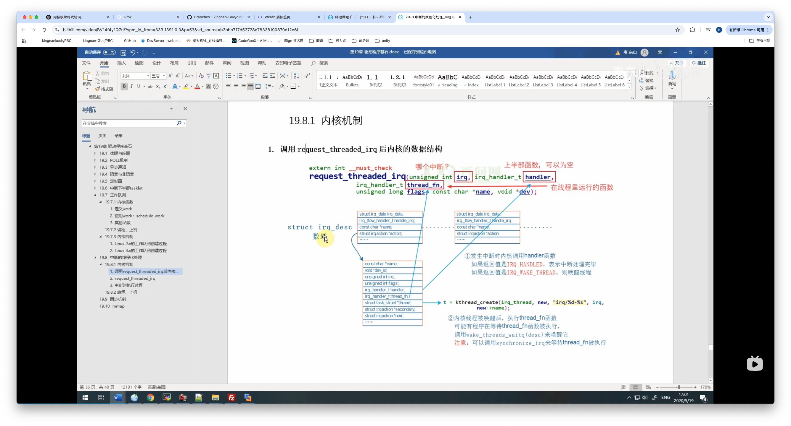

2025/03/29 02:50
# 中断的线程化处理
    分支
        dirver_raspberry_interrupt_sleep_wake_up_threadedirq_v0.1.13

    文件
        ./modules/app_XXX/app_XXX.c
        ./dirverModules/dirverModules/XXX.c

# 定义


中断的线程化处理
    1、为了解决 workqueue 中如果有多个任务排队时间长卡顿的问题，
    2、所以直接 创建一个内核线程，例如 在linux系统中，对于储存设备 比如 SD/TF 卡，它的驱动程序会 有自己的内核线程 。创建一个名为 mmc-cmd 的内核线程，用于处理 mmc 命令。
    3、使用  devm_request_threaded_irq 在 线程化的中断处理 
        a:将中断处理函数 handler 和 线程处理函数 thread_fn 绑定在一起，这样当中断发生时，内核会先调用 handler 函数，（handler 可以不提供）
        b: 然后将其放入线程处理函数 thread_fn 中执行，从而避免了中断处理函数的长时间执行，提高了系统的响应速度。thread_fn 函数 提供后 会 创建内核线程

```C
        devm_request_threaded_irq(struct device *dev, unsigned int irq,
                    irq_handler_t handler, irq_handler_t thread_fn,
                    unsigned long irqflags, const char *devname,
                    void *dev_id);

```


# 流程


# 执行顺序
    在 sources/linux-rpi-6.6.y/kernel/irq/manage.c 有 request_threaded_irq
    在 sources/linux-rpi-6.6.y/kernel/irq/devres.c 有 devm_request_threaded_irq
    在 sources/linux-rpi-6.6.y/kernel/sched.c 中 有 wake_up_process


    1、使用 devm_request_threaded_irq 函数 中会调用  request_threaded_irq  注册中断处理程序
        a: request_threaded_irq 函数 判断 如果没有 提供 handler 函数 ， 但是提供了thread_fn ， 系统会提供一个 默认的 irq_default_primary_handler ， irq_default_primary_handler 只是简单的返回 IRQ_WAKE_THREAD，可以唤醒 内核线程

    2、 action = kzalloc(sizeof(struct irqaction), GFP_KERNEL); 分配了 irqaction 结构体，并且设置了里面的内容

    3、调用 __setup_irq，设置 irq_desc 结构体，并且调用 setup_irq_thread 函数， 设置线程处理函数
    4、setup_irq_thread 函数 中  会调用 struct task_struct *t ; t = kthread_create(irq_thread, new, "irq/%d-%s", irq, new->name); 创建内核线程 
    5、struct task_struct 结构体 会放入  irqaction 结构体里面， irqaction 里面会有 一个 irq_handler_t thread_fn，  thread_fn 函数指针指向的就是 线程处理函数， 也就是 task_struct 结构体 里面的函数指针
    6、当发生中断的时候， 就可以通过 thread_fn 唤醒里面的线程
        a: 调用  wake_up 把 队列下的 线程 唤醒；
        b: 队列中是 那些 waite_event 的进程，是 由  synchronize_irq 函数 调用 waite_event 函数 放入队列的


中断的执行过程

    在 sources/linux-rpi-6.6.y/kernel/irq/handle.c 有 __handle_irq_event_percpu()
    在 sources/linux-rpi-6.6.y/kernel/irq/manage.c 中有 irq_thread()
    1、中断发生之后，


    5、handle.c 中的 irqreturn_t __handle_irq_event_percpu(struct irq_desc *desc) ,从action 结构体 得到 函数 执行， 然后 判断 返回值 是不是 IRQ_WAKE_THREAD ，如果是，那么 就调用 __irq_wake_thread 函数 ， __irq_wake_thread 函数 会调用 wake_up_process 唤醒 线程

    6、__irq_wake_thread 函数 会调用 wake_up_process 唤醒 线程， 线程被唤醒后，会执行 irq_thread 函数， 
    7、 /manage.c 中的 irq_thread 就是中断线程的 函数， irq_thread 函数 会执行 irqaction 结构体 里面的 thread_fn 函数，也就是 线程处理函数
        a: 在平时 有一个 while 死循环，休眠等待中断发生，等待中断发生，当中断发生的时候，就会跳出循环，
        b: 被唤醒之后 执行 irq_thread_fn()  函数
        c: irq_thread_fn() 函数 会执行 irqaction 结构体 里面的 thread_fn 函数，也就是 线程处理函数,也就是 action->thread_fn(action->irq, action->dev_id);
    
    8、最后   调用  wake_threads_waitq() ,去唤醒 等待它 执行完层 的函数


# 内部机制



中断系统的重要数据结构
    1、在内核里面 有一个全局的 irq_desc 数组，对于每一个 中断 都有  irq_desc 结构体 数组项， 
    2、irq_desc 中有 一个成员是  irqaction 结构体，
    3、irqaction 结构体中有一个成员是  irq_handler_t handler，  函数指针指向的就是 中断处理函数
    4、irqaction 结构体中有一个成员是 irq_handler_t thread_fn，  thread_fn 函数指针指向的就是 线程处理函数
    5、当 注册一个 中断函数的时候，如果发现  thread_fn，非空
    6、那么 使用 kernel_thread 函数创建一个 内核线程 ，并返回线程的 PID
    7、当发生中断的时候 ，上半部的 irq_handler_t handler  中断函数 首先被调用，
        a:如果是返回 IRQ_HANDLED，那么中断处理函数就结束了，不会调用线程处理函数
        b: 返回 IRQ_WAKE_THREAD； 那么中断处理函数就结束了，会调用线程处理函数,唤醒线程
    8、 被 kernel_thread创建的  内核线程  被唤醒后 ， kernel_thread 的 irq_thread 会去  执行  提供 的 thread_fn 函数，
    9、thread_fn 函数 执行完后，内核线程就结束了，中断处理就结束了
    10、就可以去唤醒  其他 等待 中断 处理完成的函数

        a: 某一个进程 synchronize_irq(irq)  等待中断处理完成,等待 thread_fn 被执行
        b： 使用 wake_threads_waitq(desc)  函数 去唤醒 等待队列 中的进程


```C

// 定义一个irqaction结构体，用于描述中断处理程序
struct irqaction {
	irq_handler_t		handler;// 中断处理函数
	void			*dev_id;// 设备ID
	void __percpu		*percpu_dev_id;// 每个CPU的设备ID
	struct irqaction	*next;// 下一个irqaction结构体
	irq_handler_t		thread_fn;// 线程处理函数
	struct task_struct	*thread;// 线程结构体
	struct irqaction	*secondary;// 二级irqaction结构体
	unsigned int		irq;// 中断号
	unsigned int		flags;// 标志位
	unsigned long		thread_flags;// 线程标志位
	unsigned long		thread_mask;// 线程掩码
	const char		*name;// 中断处理程序名称
	struct proc_dir_entry	*dir;// 进程目录条目
} ____cacheline_internodealigned_in_smp;


extern pid_t kernel_thread(int (*fn)(void *), void *arg, const char *name, unsigned long flags);


```


# Makefile
# # XXXX ---------------------
XXXX-y := $(MODULES_DIR)/XXXX/XXXX.o
obj-m := XXXX.o


# 执行命令


insmod
rmmod

chmod +x main

ps -ef | grep main
kill -9 PID

ls /proc/device-tree/
ls /sys/devices/platform/
dmesg | tail
cat /proc/devices  
cd /sys/class 


# 扩展

