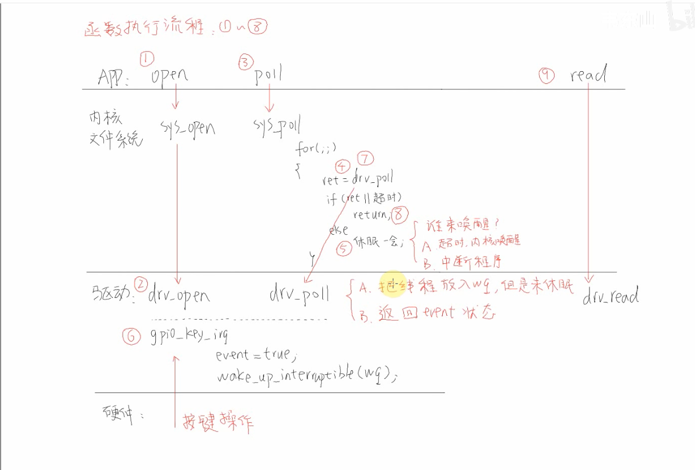

    分支
        dirver_raspberry_interrupt_poll_v0.1.7

poll 执行流程

1、open 通过 内核系统文件的 sys_open 调用驱动 的 drv_open
2、poll
    a: app 的 poll 调用 内核系统文件的 sys_poll
    b: 在 sys_poll 中
        1、有for 循环 调用每个 file 的 poll
        2、在for 循环中 会使用 ret = drv_poll(file, wait); 调用 驱动里的 drv_poll;
        3、在 驱动里的  drv_poll 中
            a: 把线程放到 wait_queue 中，但是这是 没有去休眠
            b: 返回 event 状态
        4、在 ret = drv_poll(file, wait) 后 会判断 if(ret || 超时)，如果为 true那么 返回
        5、如果为 false 那么 就会进入 休眠
            a: 在休眠的时候谁来唤醒
                1、超时 内核唤醒
                2、中断程序 唤醒
        
        <!-- 6、唤醒后，会重新调用 poll，然后会重新执行 3、4、5 步骤 -->

        7、在这个过程中 并不是在 驱动函数里面休眠，而是在 内核文件系统 中 休眠
        8、如果休眠时间到了，还没有 值返回，那么会再次进入 for 循环，然后会重新调用 驱动里的 drv_poll，然后会重新执行 3、4、5 步骤

        9、如果在中断程序中， 中断函数 会 wake_up_interruptible(&wait); event = true; 那么 会 唤醒 休眠的线程，继续执行 for 循环, 然后再次运行到 ret = drv_poll(file, wait)，调用 驱动里的 drv_poll，然后 会发现 驱动里的 drv_poll 有数据，ret 有值，那么就会返回 

    
    使用 poll机制时，驱动程序的核心就是提供对应的 drv_poll 函数，
    在drv_poll 函数中要做两件事
    1、把当前线程挂入队列 wq： poll_wait
        App 调用一次 poll ，可能导致drv_poll被调用 2 次，但是我们并不需要把当前线程 挂入队列 2次；
        可以使用内核的函数 poll_wait 把线程挂入队列，如果线程已经在队列里了，提酒不会再次挂入
    2、发挥设备状态：
        App 调用 poll函数时，有可能是查询 “有没有数据读入”：POLLIN
        也有可能是查询 “有没有空间可以写数据”： POLLOUT
        
    所以 drv_poll 要返回自己当前的状态：（ POLLIN | POLLRDNORM ） 或 （ POLLOUT | POLLWRNORM ）

    POLLIN = POLLRDNORM （兼容性）
    POLLOUT = POLLWRNORM（兼容性）

    APP 调用poll 后，很有可能会休眠，对应的 ，在案件驱动的中断服务程序中，也要有唤醒 操作

    使用poll/select 函数的 时候 可以检测多个文件

    POLLIN：有数据可读
    POLLOUT：有空间可写
    POLLERR：发生错误
    POLLHUP：挂起
    POLLNVAL：无效请求，比如请求的文件描述符不是一个有效的文件描述符，或者文件描述符没有连接到一个套接字上

    POLLIN | POLLRDNORM ：有数据可读
    POLLOUT | POLLWRNORM ：有空间可写

    POLLIN | POLLRDNORM | POLLERR | POLLHUP | POLLNVAL ：有数据可读，有错误，有挂起，无效请求

    POLLIN | POLLRDNORM | POLLOUT | POLLWRNORM ：有数据可读，有空间可写

    POLLIN | POLLRDNORM | POLLOUT | POLLWRNORM | POLLERR | POLLHUP | POLLNVAL ：有数据可读，有空间可写，有错误，有挂起，无效请求
