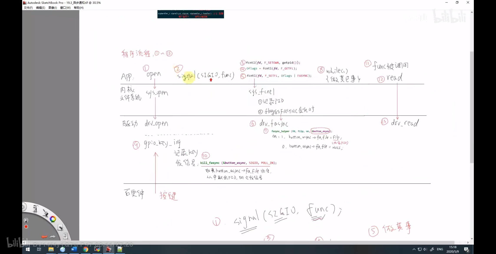

异步通知
    分支 
        dirver_raspberry_interrupt_sleep_wake_up_fasync_v0.1.8

发信号 SIGIO
  1、由驱动程序发
  2、发送 SIGIO 信号  给应用程序
  3、使用 内核提供的 函数
  4、APP  应用端 要把 自己的信息 告诉驱动程序， 并且注册信号处理函数
  5、App 收到信号后 执行信号处理函数，我觉得是 因为 app 把信号处理函数注册到驱动程序了，所以驱动程序在合适的时候  调用了 信号处理函数

流程：

  1、APP  应用程序 通过 sys_open 打开 dev_open 驱动程序， 
    a: 在sys_open 中 每一个 文件 都会构造一个 file *filep 结构体，在使用 fcntl 的时候 会把 pid 存到 filep->f_owner->files->f_owner->pid 中
  2、APP  使用 signal(SIGIO, sig_func); 注册信号处理函数
  3、App 把自己的信息 pid 告诉驱动，这样驱动就知道，当他有数据 就发给 进程 pid，
        a: 调用 fcntl 函数 ， fcntl(fd, F_SETOWN, pid);// F_SETOWN  告诉驱动程序，驱动程序有数据是了，发给 pid 进程
  4、使用 fcntl 设置 驱动程序的 flag 为 FASYNC， 启动 异步通知,这里 APP 调用 是 内核的 sys_fcntl 函数， 
       a: 首先取出 驱动程序的 flag，fcntl(fd, F_GETFL, 0);// F_GETFL获得 标志位
       b: 然后设置 flag 为 FASYNC ，最后再写回驱动程序; fcntl(fd, F_SETFL, flag | FASYNC); // 位了启动驱动程序  的 异步 
    

  5、在APP 调用 是 内核的 sys_fcntl 函数 后， sys_fcntl 会记录 pid , ，在 flag 的FASYN 变化时
    a: 会调用 驱动 的  drv_fasync

 6、驱动 的  drv_fasync 这里 可以调用 fasync_helper 函数。启动异步
    a： fasync_helper(fd, flip, on, &button_async);
        1、当 flag 的 FASYNC 为 1 的时候，这里的 on 会 为 1

            当 on 为 1 的时候， 会分配 button_async 结构体， 并且设置  button_async 里面的 的 fa_file  为 filep， filep 里面包含 pid； 这样驱动程序 就可以找到这个 pid

        2、禁止  异步通知的 时候 使用  FASYNC 为 0，这里的 on 会 为 0

            当 on 为 0 的时候， 会释放 button_async 结构体， 并且设置  button_async 里面的 的 fa_file  为 NULL， 设置为 null 的时候，驱动程序 就找不到这个 pid 了

  7、当 按下按键 进入中断的时候， 发信号是 kill_fasync(&button_async, SIGIO, POLL_IN) ;如果 button_async 的 fa_file 为 filep，在  里面有 pid 的话，就会发送 SIGIO 信号给 pid，发送信号给 APP

    a:驱动程序发送 SIGIO 信号给 APP， 表示有 IO信号了，
        在 include/uapi/asm-generic/signal.h 中有定义 其他一些信号
        #define SIGIO  22

  8、APP  应用程序  注册信号处理函数，使用 signal(SIGIO, sig_func); sig_func 会在收到 SIGIO 信号的 时候 执行， 在 sig_func 中调用 read 函数 ，读取值

Makefile

    # fasync
    interrupt_sleep_wake_up_fasync-y := $(MODULES_DIR)/interrupt_sleep_wake_up_fasync/interrupt_sleep_wake_up_fasync.o
    obj-m := interrupt_sleep_wake_up_fasync.o