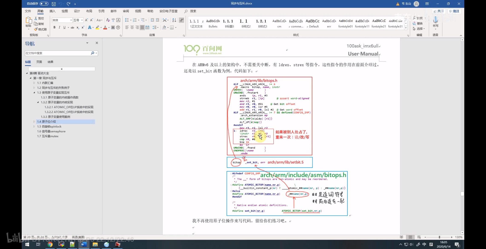

2025/03/31 21:38
# 原子操作的实现原理与使用
    分支
        dirver_raspberry_XXXXX_vX.X.X

    文件
        ./modules/app_XXX/app_XXX.c
        ./dirverModules/dirverModules/XXX.c

# 定义

使用原子变量实现互斥
    1、原子操作
        原子变量
        原子位
    2、原子变量
    3、自旋锁
    4、信号量
    5、互斥锁

原子变量的内核操作函数
    
    原子变量的操作函数在 Linux 内核文件 sources/linux-rpi-6.6.y/include/linux/atomic.h
    原子变量类型如下，就是一个结构体 ， sources/linux-rpi-6.6.y/include/linux/types.h
    
```C

typedef struct {
    int counter;
} atomic_t

```

特殊的地方在于 操作函数，这些操作函数都是 原子 不会被打断
    atomic_read                 读出原子变量的值，即V->counter； 读出 数据只有一条 指令，不涉及 被打断；
    atomic_set                  设置原子变量的值，即V->counter = i
    atomic_add                  原子变量增加i，即V->counter += i
    atomic_sub                  原子变量减少i，即V->counter -= i
    atomic_inc                  原子变量加1，即V->counter += 1
    atomic_dec                  原子变量减1，即V->counter -= 1
    atomic_inc_and_test         原子变量 先加1，然后判断是否为0，为0则返回 1，否则返回 0
    atomic_dec_and_test         原子变量 先减1，然后判断是否为0，为0则返回 1，否则返回 0
    atomic_sub_and_test         原子变量 先减去i，然后判断是否为0，为0则返回真，否则返回假
    atomic_dec_return           原子变量 先减1，然后返回减1后的值


原子变量的内核实现
    1、atomic_read， atomic_set 这些操作都只需要一条汇编指令，所以他们本身就是不可打断的
    2、问题在于 atomic_inc 这类操作，要独处修改写回
        a、以 atomic_inc 为例，它需要三条指令，所以不能保证原子性
            #define atomic_inc(v) (atomic_add(1, v))

            atomic_add 是如何实现的呢
                1、#define ATOMIC_OPS(add, +=, add); 展开之后 得到 
                    ATOMIC_OP(add, +=, add)					\
                    ATOMIC_OP_RETURN(add, +=, add)				\
                    ATOMIC_FETCH_OP(add, +=, add)


                    ```C

                        ##op 是 add ，c_op 是 +=  #asm_op 是 add

                        // sources/linux-rpi-6.6.y/arch/arm/include/asm/atomic.h
                        #define ATOMIC_OP(op, c_op, asm_op)					\
                        static inline void arch_atomic_##op(int i, atomic_t *v)			\
                        {									\
                            unsigned long tmp;						\
                            int result;							\
                                                            \
                            prefetchw(&v->counter);						\
                            __asm__ __volatile__("@ atomic_" #op "\n"			\
                        "1:	ldrex	%0, [%3]\n"						\               // 读出 第三个参数 %3 的值，即V->counter ，读入到 %0 ，这个操作数 会指向 第 0 个地址； ldrex 是 ldreader exclusive 的缩写，即独占加载，防止其他CPU同时访问该内存地址
                        "	" #asm_op "	%0, %0, %4\n"					\           // 这个是 add 操作，把 %0 加上 %4 的值 再赋值给 %0，即V->counter += i 
                        "	strex	%1, %0, [%3]\n"						\           // 第 0 个操作数 %0 已经是新的值， 把 新的值写入 第三个参数 %3 ，即V->counter = V->counter + i； strex 是 store exclusive 的缩写，即独占存储，防止其他CPU同时访问该内存地址
                        "	teq	%1, #0\n"						\
                        "	bne	1b"							\
                            : "=&r" (result), "=&r" (tmp), "+Qo" (v->counter)		\
                            : "r" (&v->counter), "Ir" (i)					\
                            : "cc");							\
                        }


                        arch_atomic_add 不断尝试，直到成功为止

                        1、读入
                            ldrex %0 【%3】
                                1、从 %3 读入 数据到 %0,   【%3】这个 都会指向一个地址 addr ， 所以读 是 读取  addr
                                2、会把 addr 标记为 独占访问

                        2、修改
                            add %0, %0, %4
                                1、把 %0 加上 %4 的值 再赋值给 %0，即V->counter += i 
                                2、%0 是 第一个操作数，所以 %0 的值就是 V->counter 的值， %0 是一个新 值

                        3、写入
                            strex %1, %0, 【%3】
                                1、把 %0 写入 【%3】， %0 是新的值； %1 是 一个返回值，用来判断是否写入成功
                                2、把 addr 标记为 非独占访问

                                正常情况下
                                    a、发现 在  1 步骤的时候， addr  还是 标记 独占访问，那么执行下一步
                                    b、写入新值
                                    c、把 addr 标记为 非独占访问
                                    d、返回 0， 表示写入成功； %1 是一个返回值，用来判断是否写入成功，所以 %1 = 0

                                异常情况下，被别人抢占了
                                    被抢占 ： 就是被别人抢先 完成了 ldrex、strex 的操作步骤，而  strex 会清除  addr 的独占标记 ，所以 这里的 strex 会发现addr 的独占标记没有了

                                    a、发现 在  1 步骤的时候， addr 标记 非独占访问
                                    b、放弃 写入 。写入新值失败， %1 = 1

                        4、判断
                            teq %1, #0
                                1、判断 %1 是否为 0
                                2、如果 %1 不为 0 ，则表示 写入失败，需要重新执行 1、2、3 步骤，直到写入成功为止

                        5、bne 1b
                            1、如果 %1 不为 0 ，则表示 写入失败，需要重新执行 1、2、3 步骤，直到写入成功为止
                            2、1b 是一个标签，表示跳转到 1: 这个标签的位置


                        #define ATOMIC_OP_RETURN(op, c_op, asm_op)				\
                        static inline int arch_atomic_##op##_return_relaxed(int i, atomic_t *v)	\

                    ```


                    ```C


                        // sources/linux-rpi-6.6.y/arch/arm/include/asm/atomic.h
                        #define ATOMIC64_OP(op, op1, op2)					\
                        static inline void arch_atomic64_##op(s64 i, atomic64_t *v)		\
                        {									\
                            s64 result;							\
                            unsigned long tmp;						\
                                                            \
                            prefetchw(&v->counter);						\
                            __asm__ __volatile__("@ atomic64_" #op "\n"			\
                        "1:	ldrexd	%0, %H0, [%3]\n"					\
                        "	" #op1 " %Q0, %Q0, %Q4\n"					\
                        "	" #op2 " %R0, %R0, %R4\n"					\
                        "	strexd	%1, %0, %H0, [%3]\n"					\
                        "	teq	%1, #0\n"						\
                        "	bne	1b"							\
                            : "=&r" (result), "=&r" (tmp), "+Qo" (v->counter)		\
                            : "r" (&v->counter), "r" (i)					\
                            : "cc");							\
                        }	


                    ```

                2、#define ATOMIC_OPS(op, c_op, asm_op)					\
                    ATOMIC_OP(op, c_op, asm_op)					\
                    ATOMIC_OP_RETURN(op, c_op, asm_op)				\
                    ATOMIC_FETCH_OP(op, c_op, asm_op)


在内核里面实现原子变量的实现有两套机制
    1、对于小于 ARM v6 指令集 之下的 cpu ，不支持 SMP ，也不支持 多 cpu 系统，所以只需要关闭中断就可以 ，关闭 中断， Vaild++ ; 恢复中断
    2、对于 ARM v6 指令集 之上的 cpu ，可以使用特殊的指令




原子位的操作
    sources/linux-rpi-6.6.y/arch/arm/include/asm/bitops.h

    能操作 原子变量，再去操作某一位

    p 是一个 unnsiged long 类型的指针，nr 是一个 bit 的编号，即第 nr 位

    #define set_bit(nr,p)           ATOMIC_BITOP(set_bit,nr,p)                      设置 （*p） 的 bit nr 为 1
    #define clear_bit(nr,p)         ATOMIC_BITOP(clear_bit,nr,p)                    清除 （*p） 的 bit nr 为 0
    #define change_bit(nr,p)        ATOMIC_BITOP(change_bit,nr,p)
    #define test_and_set_bit(nr,p)      ATOMIC_BITOP(test_and_set_bit,nr,p)         测试 （*p） 的 bit nr 是否为 1
    #define test_and_clear_bit(nr,p)    ATOMIC_BITOP(test_and_clear_bit,nr,p)
    #define test_and_change_bit(nr,p)   ATOMIC_BITOP(test_and_change_bit,nr,p)


# 流程

驱动程序
```C

static atomic_t valid  = ATOMIC_INIT(1); // 初始化为 1, 会把 结构体例的count 值设置为1

static int device_open(struct inode *inode, struct file *file) {
    printk(KERN_INFO "%s %s %d \n", __FILE__, __FUNCTION__, __LINE__);

    // 经过 atomic_dec_and_test 操作之后 ， 1 - 1， valid = 0， 返回 1，表示成功；
    // 如果 valid = 0，经过 atomic_dec_and_test 操作之后， valid = -1，那么 返回 失败 ，会执行 atomic_inc

    if(atomic_dec_and_test(&valid)){
        retrurn 0;
    }
    atomic_inc(&valid);// 那么这里就会把 valid + 1， valid = 0，返回 -EBUSY，表示失败
    return -EBUSY;
}

static int device_release(struct inode *inode, struct file *file) {
    printk(KERN_INFO "%s %s %d \n", __FILE__, __FUNCTION__, __LINE__);
    atomic_inc(&valid);
    return 0;

}


```


# 执行顺序


# 内部机制


# Makefile
# # XXXX ---------------------
XXXX-y := $(MODULES_DIR)/XXXX/XXXX.o
obj-m := XXXX.o


# 执行命令


insmod
rmmod

chmod +x main

ps -ef | grep main
kill -9 PID

ls /proc/device-tree/
ls /sys/devices/platform/
dmesg | tail
cat /proc/devices  
cd /sys/class 


# 扩展

多个 cpu 系统，拥有 有多个中断，在程序里 关闭中断 只能 关闭当前cpu 的中断，其他cpu 还在运行

每一个变量的修改都要经历 三个步骤
    1、读取变量
    2、修改变量
    3、写入变量
