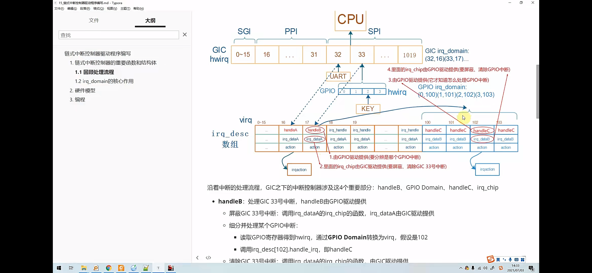

2025/05/13 00:10
# 链式中断控制器驱动编写程序
    分支
        dirver_raspberry_XXXXX_vX.X.X

    文件
        ./modules/interrupt_system/virtual_interrupt_system.c
        ./modules/interrupt_system/gpio_key_drv.c
        ./dirverModules/dirverModules/XXX.c

当前试过很多的 设备树 都无法 创建虚拟的中断 所以 只能写完代码，但是并不能真正云行

# 定义

驱动程序 需要提供 
handleX
irq_dataA

action

使用 irq_domain 保存映射
主要就睡构造 irq_domain

irq_domain会把 handleB GPIOdomain handleC irq_chip 结构体 组织起来

# 如何解析设备树里的 中断信息

gpio_keys {
    compatible = "gpio-keys";
    interrupt-parent = <&gpio>;// gpio中断控制器
    interrupts = <6 0>;// 6号中断 上升沿触发
}
根据 interrupt-parent 找到驱动程序 注册的 irq_domain
使用 irq_domain.ops 中的 translate 或 Xlate 函数解析设备设备树、得到 hardware_irq 和 type

分配一个 irq_desc 结构体，并初始化 得到 irq
    把 irq_desc 和 hardware_irq 关联起来 存到 irq_domain 
    把 virtual_irq 存入到 这个设备树的设备节点所对应的 平台设备 plateform_device  的 resouce中

使用 irq_domain.ops 中的 alloc 或 map 函数进行设置
    替换 irq_desc[virtual_irq].handle_irq 函数 
    替换 irq_desc[virtual_irq].irq_data 里面有 irq_chip

用户的驱动程序注册中断
    从 platform_device 的 resouce 中得到 虚拟中断号 virtual_irq
    requset_irq(virtual_irq, handleX, action, name, dev)

查找手册 查到 rpi3B+ 上没有用到的 中断号 是  : IRQ 96 及以上：通常未分配，可能是保留或未使用。选择 IRQ 96-127 作为虚拟中断控制器的中断号，因为这些号通常不被 BCM2837 的硬件外设使用

链式
    在 GIC 上 hardware_irq  中 找到 第 n 个 中断
    在第n个中断上 扩展出 新的 四个中断 对应一个 hardware_irq

层级控制器
    在 GIC 上 hardware_irq  中 找到 第 n 个 中断
    在第n个中断上 扩展出 新的 四个中断 对应4 个 hardware_irq， n， n+1， n+2， n+3

使用指令模拟产生中断，但我觉得 可以使用真实的 gpio 产生中断到 虚拟中断 控制器上

# 流程

参考 sources/linux-rpi-6.6.y/drivers/gpio/gpio-mxc.c 驱动

gpio 控制器 向上一层发送 发送 n 号 中断

虚拟的 中断控制器 会向 GIC 发出 n 号中断
    从设备树里 面获得 n 号中断的 
    虚拟中断号 virtual_irq

在 
sources/linux-rpi-6.6.y/arch/arm64/boot/dts/broadcom/.bcm2710-rpi-3-b-plus.dtb.dts.tmp
文件中 找到

local_intc: local_intc@40000000 {
    compatible = "brcm,bcm2836-l1-intc";
    reg = <0x40000000 0x100>;
    interrupt-controller;
    #interrupt-cells = <2>;
    interrupt-parent = <&local_intc>;
};

&intc {
    compatible = "brcm,bcm2836-armctrl-ic";
    reg = <0x7e00b200 0x200>;
    interrupt-parent = <&local_intc>;
    interrupts = <8 4>;
};

/{
    interrupt-parent = <&intc>;

    intc: interrupt-controller@7e00b200 {
        compatible = "brcm,bcm2835-armctrl-ic";
        reg = <0x7e00b200 0x200>;
        interrupt-controller;
        #interrupt-cells = <2>;/** 要使用这个中断控制器的时候  使用两个参数描述 这个中断 */
    };
}

没有找到 gic 

# DTS

#define n 100

/{
    /** 中断控制器设备树 这个节点会被转换为 一个 platform_device */
    virtual_irq_controller: virtual_irq_controller {
        compatible = "kingnan,virtual_irq_controller";
        interrupt-parent = <&intc>;/** 指定中断控制器 , 向 这个中断控制器 发送 n 号 中断 */
        interrupt-controller;/** 声明这个节点是一个中断控制器 */
        #interrupt-cells = <2>;/** 要使用这个中断控制器的时候  使用两个参数描述 这个中断 */
        interrupts = <n 0>;/** 这个中断控制器的中断号 */
        reg = <0x7e200000 0x1000>; /** 虚拟寄存器地址*/
    }

    /** 按键程序设备树 */
    gpio_keys: gpio_keys {
        compatible = "kingnan,gpio-keys";
        interrupt-parent = <&virtual_irq_controller>;/** 指定中断控制器 */
        interrupts = <0 1>, <1 1>;/** 使用 虚拟中控制器中的  0号中断   上升沿触发 */
    }

    gpio_keys: gpio-keys {
        compatible = "kingnan,gpio-keys";
        interrupt-parent = <&virtual_irq_controller>;
        interrupts = <0 1>, <1 1>;
        gpios = <&virtual_gpio 0 GPIO_ACTIVE_LOW>, <&virtual_gpio 1 GPIO_ACTIVE_LOW>;
        linux,code = <KEY_A>, <KEY_B>;
        label = "key1", "key2";
        pinctrl-names = "default";
        pinctrl-0 = <&virtual_pins>;
    };

    &gpio {

        my_interrupt_pins: my_interrupt_pins  {
            brcm,pins = <24 25>;// 引脚号
            brcm,function = <0>;// 输入模式
            brcm,pull = <2>;// 上拉
        };
    }

}

# 执行顺序

# 内部机制

# Makefile
# # interrupt_system    子系统 ---------------------
virtual_interrupt_system-y := $(MODULES_DIR)/interrupt_system/virtual_interrupt_system.o
obj-m += virtual_interrupt_system.o
gpio_key_drv-y := $(MODULES_DIR)/interrupt_system/gpio_key_drv.o
obj-m += gpio_key_drv.o

或是 

virtual_interrupt_system-y := $(MODULES_DIR)/interrupt_system/virtual_interrupt_system_linear.o
obj-m += virtual_interrupt_system.o
gpio_key_drv-y := $(MODULES_DIR)/interrupt_system/gpio_key_drv.o
obj-m += gpio_key_drv.o

# 执行命令

insmod
rmmod

chmod +x main

ps -ef | grep main
kill -9 PID

ls /proc/device-tree/
ls /sys/devices/platform/
dmesg | tail
cat /proc/devices  
cd /sys/class 

搜素的时候 加上
sources/linux-rpi-6.6.y/arch/arm64/boot/dts/broadcom

# 扩展

运行 cat /proc/interrupts 检查 IRQ 100 是否被占用。

make ARCH=arm64 CROSS_COMPILE=aarch64-linux-gnu- dtbs -j$(nproc) 